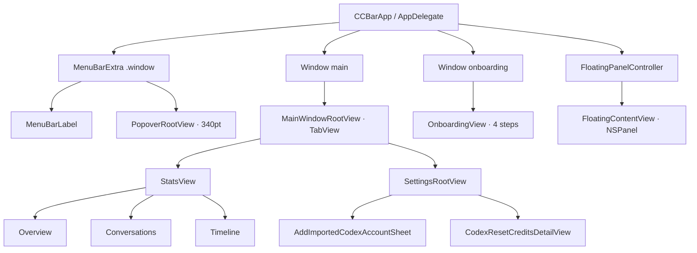
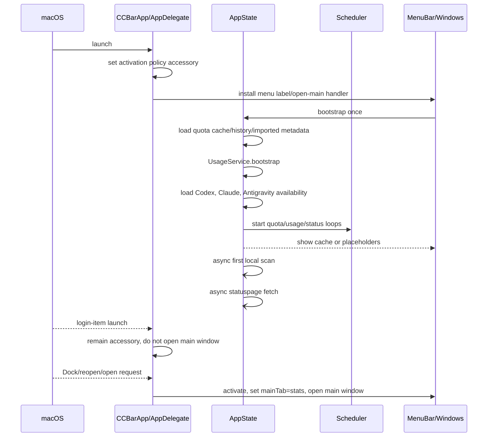

# 02 · 页面、窗口与交互地图

## 窗口和宿主关系

上图是当前代码关系，不是新版信息架构要求。**代码已确认**：主窗口只有 Statistics 和 Settings 两个 Tab；Statistics 内部再切 Overview / Conversations / Timeline；Onboarding 和 HUD 是独立的 Window/NSPanel 路径。

## 启动、冷启动和正常打开

### 启动状态

| 场景 | 当前行为 | 证据 |
|---|---|---|
| 首次启动 | `didCompleteOnboarding == false` 时设置 `shouldShowOnboarding`，由菜单栏根视图打开 onboarding。 | **代码已确认**：`CCBarApp.swift`、`Core/AppState.swift`、`Core/Storage/Settings.swift` |
| 登录项启动 | AppDelegate 识别 Apple Event，保持 accessory，不主动弹主窗口。 | **代码已确认** |
| 从 Dock/Launchpad/Raycast 打开 | handler 先设 `mainTab = .stats`，激活 App，再打开 main。 | **代码已确认** |
| 已打开主窗口再次 reopen | AppDelegate 请求统计窗口。 | **代码已确认** |
| bootstrap 重入 | `didBootstrap` 防止重复初始化。 | **代码已确认** |
| 首次额度网络请求 | bootstrap 本身读取缓存和凭据、启动 Scheduler；立即异步做日志扫描和状态拉取，额度主要由周期 loop 或用户刷新触发。 | **代码已确认**；若产品要求“启动立即刷新额度”，新版需单独确认 |

## 菜单栏 Label

路径：`MenuBar/MenuBarLabel.swift`。

- 使用自绘 template `NSImage`，图标高度 18、整体高度 22；数字使用 monospaced menu-bar font。**代码已确认**。
- Provider 顺序固定 Codex → Claude Code → Antigravity；菜单栏显示由全局 Provider enabled 与 menuBar 开关共同决定。**代码已确认**。
- `MenuBarWindowChoice`：`primary`、`weekly`、`both`；两者模式按 limit id 去重。无 snapshot/window 用 `--`。**代码已确认、测试已确认**。
- 没有可见 Provider 时，仍返回 Codex 图标占位，避免菜单栏图标消失。**代码已确认**。
- template 图标只能随系统菜单栏深浅反色，额度状态色不会直接作用于菜单栏文字。**代码已确认**。

## Popover

路径：`MenuBar/PopoverRootView.swift`、`MenuBar/OtherCodexAccountsSection.swift`；固定宽度 340pt。**代码已确认**。

### Header

当前顺序是：

`Usage/用量` + “几秒/几分钟前刷新” → live/stale/offline 状态点 → 刷新 → Statistics → Settings → Quit。

- 状态点按启用 Provider 的最近成功时间计算：当前 interval 的 1.5 倍内 live，3 倍内 stale，之后 offline；无成功但有错误时 offline。**代码已确认**。
- 刷新按钮不禁用；`AppState.refreshNow()` 内部整体 in-flight 去重，真正开始刷新时旋转图标。**代码已确认**。
- `⌘R` 和点击刷新走同一整体刷新链；整体刷新同时包含 quota、local scan、service status。**代码已确认**。
- 设计文档的旧注释仍提到 kebab/footer，但当前实现已经用四个一级图标；布局文档正文也说明 footer 已移除。**代码已确认 / 文档部分残留**。

### 服务卡片

每个启用的主 Provider 一块：logo tile、Provider 名称、邮箱/plan（受 privacy mode 影响）、官方服务状态点、主要剩余百分比、动态窗口名、主进度条、reset time、Codex/Claude 的今日与本周 API 等值花费，以及次要/模型/Gemini 行。

- 主要额度标签由 `QuotaLimitKind` 决定：`5HOUR`、`WEEKLY`/Claude 的 `ALL`、模型名或 `CURRENT`。**代码已确认**。
- 剩余颜色统一 `statusColor`：>50% 中性灰，20%–50% 黄，<20% 橙，0 红。**代码已确认**。
- reset time 默认相对显示；hover 时切换为相反格式，`TimelineView` 每分钟推动倒计时。**代码已确认**。
- 失败保留旧 snapshot，并在卡片底部用橙色警告图标和截断错误；没有 snapshot 时主数值为 `--`。**代码已确认**。
- Claude 动态模型周额度和 Antigravity 的 Gemini 5h/weekly 会以紧凑行追加；没有数据时不虚构额度。**代码已确认**。

### 其他 Codex 账号

- 只有 `visibleInPopover` 的导入账号显示；与当前主账号同身份的镜像项在展示层去重。**代码已确认**。
- 每行显示别名/邮箱/plan（隐私模式下名称隐藏，只保留 plan）、5H/WK 小条、百分比、reset time；加载、错误、空快照分别有状态。**代码已确认**。

### Popover 边界状态

| 状态 | 当前展示 |
|---|---|
| 无启用 Provider 且无可见导入账号 | `No services enabled · 未启用任何服务`，提示到 Settings → Accounts。 |
| 有缓存、正在刷新 | 继续显示旧数据；刷新按钮旋转，Provider 行可显示 in-flight。 |
| API 失败但有旧 snapshot | 旧额度保留，底部显示错误；header 可能为 stale/offline。 |
| API 失败且无 Claude snapshot，用户手动刷新 | 额外尝试 CLI fallback；成功来源标记为 `cliFallback`。 |
| Antigravity 已安装但未运行 | 显示 Provider，但额度失败状态来自 availability。 |
| 无本地日志 | Statistics 对应面板显示 No data / Waiting for data。 |

## 主窗口

路径：`CCBarApp.swift`、`Main/MainWindowRootView.swift`。当前 Scene 默认尺寸为 1280×680；根视图最小尺寸为 1040×520。**代码已确认**。布局文档声称的默认 1080×680、最小 800×520 与代码不一致，见 [09](09-源码核查清单与文档冲突.md)。

### Statistics Tab

左侧约 200pt sidebar：

- Service：All、Codex、Claude Code、Pi、OpenCode；过滤项随设置页「统计服务」可见集合增减，选中项被关闭时自动回退 All。Antigravity 不在本地用量统计过滤器中。**代码已确认**（2026-08-07 `1023969`）。
- View：Overview、Conversations、Timeline。**代码已确认**。

#### Overview

- 日期范围：Today、Yesterday、Week、Month、Year、7d、30d、All、Custom；Custom 显示起止 DatePicker。**代码已确认**。
- 顶部 KPI：总 Tokens、总花费、各可见服务卡片（全开为 6 张，单行排列），并可显示与上一等长区间的 delta。**代码已确认**。
- Token breakdown：输入、输出、缓存命中、命中率；Fast 时追加原始 Tokens、计费等效 Tokens、倍率、估算费用和占比。**代码已确认**。
- By service：按费用占比、总 Token、Token 分类、Fast 摘要；可见服务 >3（全开即 4 个）时两列网格换行、每行两张对齐铺满，≤3 个保持单行；全部服务被关闭时显示空态引导。**代码已确认**（2026-08-07 `1023969`/`5949687`）。
- Daily usage：可见服务堆叠柱图，柱高按当日各服务 `totalTokens`（输入含缓存读/写 + 输出），不再按费用（2026-08-03 `a22fa34`）；单日范围时会扩展近 14 天上下文，支持 hover 选中日和明细 tooltip。**代码已确认**。
- By model：按服务分组，显示模型 Token、费用、Token 拆分、Fast。**代码已确认**。

#### Conversations

`Main/ConversationStatsView.swift` 使用左右 HSplitView：左侧列表，右侧全生命周期详情。

- 顶部：标题/项目搜索、项目菜单、Recent/Tokens/Cost 排序、扫描状态、刷新本地用量、日期范围。
- 项目状态区分 available、unavailable、unassigned、system；同名项目用父目录辅助区分。
- 列表单行显示 Provider、标题、时间、项目、模型、速度摘要、请求数、Token、估算费用；超过 200 行可 Show more。
- 详情显示 Conversation ID（可复制）、项目/分支/时间/持续时间/子任务、Token breakdown、Token 明细、费用构成、速度档位、按模型明细。
- 详情固定展示该对话的全生命周期，不受上方日期范围筛选影响。**代码已确认**。
- 首次进入或数据陈旧时，View 自己调用 `UsageService.scanNow()`。**代码已确认**。

#### Timeline

- 标题是今日主要额度，只展示额度整数剩余值发生变化的点。**代码已确认**。
- 按 Codex 主账号、导入账号、Claude 主账号分段；主账号镜像去重。
- 每段有 Current / Today delta / Latest，宽窗口下左图右表，窄窗口上下堆叠；表格超过 8 行内部滚动。**代码已确认**。
- 额度窗口切换或账号身份变化会影响历史基线；主 limit kind 变化时清空该账号当天的旧事件。**代码已确认**。

### Settings Tab

路径：`Settings/SettingsRootView.swift`、`Settings/ImportedCodexAccountsView.swift`。

实际分组：Accounts、Other Codex Accounts、Menu Bar、Floating HUD、Refresh、Stats services、General。包括 Provider 全局/菜单栏/HUD 开关、菜单栏周期、HUD 开关、额度/日志间隔、reset time、状态圆点、统计服务过滤开关、重新计算、语言、privacy mode、launch at login、版本。**代码已确认**。

「Stats services」（统计服务）组是 2026-08-07 `1023969` 新增：Codex／Claude Code／Pi／OpenCode 四个开关，默认全开，关闭后 KPI／Token 拆分／每日用量／按服务／按模型／对话页统一过滤，占比分母只统计可见服务（归一化），全关时按服务面板显示空态引导。**代码已确认**。

导入账号 Add Sheet 宽高 460×460，支持 auth JSON、数组、PAT；解析后预览、选择是否显示、保存/批量导入，删除有 confirmation dialog。**代码已确认**。

## Floating HUD

`Floating/FloatingPanel.swift` + `FloatingPanelController.swift` + `FloatingContentView.swift`。

- 无标题无边框 `NSPanel`、nonactivating、floating level、全 Space/fullscreen auxiliary、不成为 key/main、可拖动。**代码已确认**。
- 内容是固定两行 pill：ServiceTile + 剩余条 + 百分比；没有额度时 `--%`，没有启用行时 `No services`。**代码已确认**。
- 设置启用后创建并 orderFrontRegardless；内容改变时按 fitting size 收缩；didMove / didEndLiveResize 持久化 frame；拖动结束近似 debounce 200ms 后靠边吸附。**代码已确认**。
- 保存位置若落在所有屏幕外，回到主屏右下角默认位置；不读取旧版其他应用的位置。**代码已确认**。
- 设计文档列出的 8 variant、位置选择器、透明度等当前没有对应 Settings 字段。**文档声称 / 代码未确认，实际视为未实现**。

## Onboarding

`Onboarding/OnboardingView.swift` 固定 620×520，四个状态由本地 `step` 控制：

1. Welcome：说明三类 Provider，Get started。
2. Detect accounts：展示 Codex、Claude、Antigravity 检测结果、来源和只读说明。
3. Configure：配置菜单栏三 Provider 开关与 HUD 开关。
4. Ready：Close 或 Open Statistics；两者都会写完成标志。

**代码已确认**：Onboarding 没有把账号导入、Provider 登录或网络授权做成流程；只是读取当前探测结果和显示开关。

## 全局交互和退出

| 操作 | 当前行为 | 证据 |
|---|---|---|
| `⌘,` | 打开主窗口 Settings | **代码已确认**：`CCBarApp.swift` Commands |
| `⌘1` | 打开主窗口 Statistics | **代码已确认** |
| `⌘R` | 整体手动刷新 | **代码已确认** |
| Popover 外点击 / Esc | 系统 MenuBarExtra 行为关闭 | **文档声称、代码未自定义** |
| Popover power | `NSApp.terminate(nil)` | **代码已确认** |
| 主窗口出现 | activation policy 变 regular，显示 Dock 入口 | **代码已确认** |
| 主窗口消失 | activation policy 切回 accessory | **代码已确认** |

