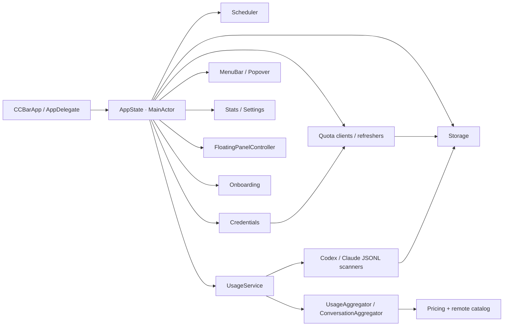
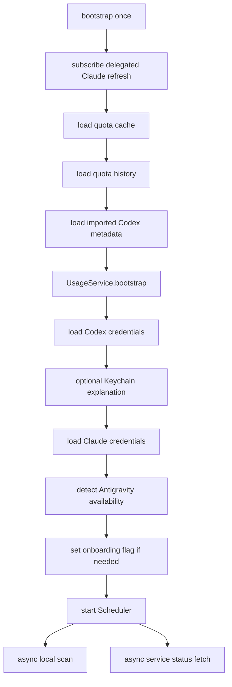
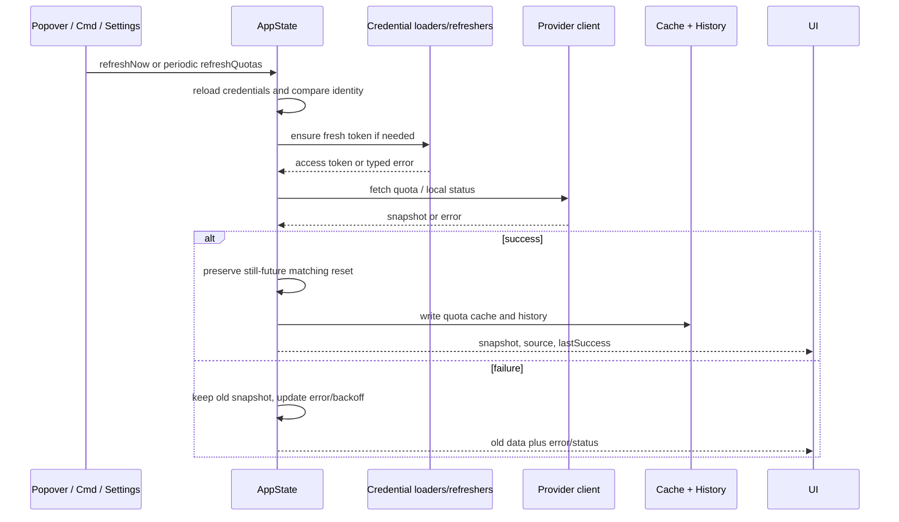

# 03 · 架构、模块与核心流程

## 工程形态

| 项 | 当前事实 | 证据 |
|---|---|---|
| 平台 | macOS 14.0+，单 App target | **代码已确认**：`ccbar.xcodeproj/project.pbxproj` |
| UI | SwiftUI 为主，AppKit 为菜单栏图像、NSPanel、生命周期、Keychain/SMAppService 辅助 | **代码已确认** |
| 依赖 | 工程没有 Swift Package 或第三方运行库；使用 Foundation、Observation、Charts、AppKit、ServiceManagement 等系统框架 | **代码已确认** |
| 状态 | `AppState` 为 `@Observable @MainActor`，由 `CCBarApp` 持有并注入环境 | **代码已确认** |
| 并发 | Swift Concurrency；若干 actor 做 refresh dedupe；本地 scan 在 detached task 运行后回主 Actor 发布 | **代码已确认** |
| Xcode Swift 配置 | `SWIFT_VERSION = 5.0`，同时启用 MainActor default isolation / approachable concurrency | **代码已确认**；`docs/技术实现.md` 写“Swift 6”，属于冲突 |

## 模块地图



### 入口层

- `CCBarApp.swift` 组装三个 SwiftUI Scene：MenuBarExtra、main Window、onboarding Window；注册 Commands；在 menu label 的 `.task` 中 bootstrap 并绑定 HUD。**代码已确认**。
- `AppDelegate.swift` 负责 accessory/regular 生命周期、登录项静默启动、reopen/open-main 事件转交。**代码已确认**。
- `Info.plist` 用 `LSUIElement=true` 隐藏 Dock 默认入口，`CCBar.entitlements` 关闭 App Sandbox。**代码已确认**。
- `Helpers/CCBarClaudeWatchdog/main.swift` 是随 App 嵌入的独立 POSIX helper，只负责启动 Claude CLI、转发信号、父进程死亡清理；不是业务模块。**代码已确认**。

### AppState

`Core/AppState.swift` 是当前业务协调中心，不是纯数据 store。它同时持有：

- Codex、Claude、Antigravity 主账号与 availability。
- 主 Provider 的 `QuotaSnapshot`、source、error、refresh state。
- 导入 Codex 元数据、独立快照/错误/刷新状态。
- quota history、今日费用、Provider status。
- `UsageService`、`Scheduler`、整体 refresh in-flight。

其职责包括凭据重读、身份变化时清理错配快照、Provider 调用、节流/退避、成功持久化、失败保留旧数据、导入账号并发刷新、通知触发的 Claude 后台刷新后复查。**代码已确认**。

## Bootstrap 流程



**代码已确认**：bootstrap 先恢复可展示状态，再启动后台工作；它不会把网络请求的失败变成“清空 UI”。缓存可以先让菜单栏显示旧 snapshot，日志和 status 在后台更新。当前代码没有在 bootstrap 尾部直接调用一次 `refreshQuotas`；第一次额度请求由周期 loop 或用户刷新触发，这是新版是否需要改变的待确认产品选择。

## 刷新与 Provider 调用链



### Provider 调度

- Scheduler 的 quota loop、usage loop、status loop 三条 Task 相互独立。改变 quota/usage interval 会取消并重启相应 Task；status 固定 5 分钟。**代码已确认**。
- `AppState.refreshNow()` 以一个整体 Task 去重：同一时刻的重复点击直接返回，不排队；整体完成顺序为 quota → usage scan → status。**代码已确认**。
- Provider 自身另有 in-flight、周期最小成功间隔和 429 backoff；所以“整体刷新去重”和“单 Provider 请求去重”是两层。**代码已确认**。
- 成功写入时按 limit id/kind 保留仍在未来的旧 reset；身份切换时先清除旧 snapshot/cache，避免新账号显示旧账号额度。**代码已确认**。

## 用量流程

```mermaid
flowchart TD
    A["UsageService.bootstrap"] --> B{ "rollup and scan state compatible?" }
    B -- yes --> C["restore usage/conversation rollups"]
    B -- no --> D["full rebuild"]
    C --> E["refresh pricing catalog in background"]
    D --> E
    F["scanNow"] --> G["commit pending pricing"]
    G --> H["check fingerprint/generation"]
    H --> I["parallel Claude + Codex incremental scans"]
    I --> J["ingest entries and conversation seeds"]
    J --> K["write usage rollup and conversation rollup"]
    K --> L["write scan-state with same generation"]
    L --> M["publish today's cost and revision"]
```

`UsageService` 将同一批 `UsageEntry` 同时送入每日 UsageAggregator 和 ConversationAggregator；写盘先写 rollup，最后写 scan-state，两个 rollup 和 watermark 共享 generationID 与 pricing fingerprint。保存失败或扫描异常会 invalidate scan-state，使下次重建，而不是继续相信可能部分写入的索引。**代码已确认**。

## 并发和隔离要点

| 场景 | 当前机制 | 证据 |
|---|---|---|
| Claude OAuth refresh | `ClaudeTokenRefresher.Coordinator` actor 合并 in-flight；请求前重读文件/Keychain；`invalid_grant` 软恢复。 | **代码已确认** |
| Claude delegated refresh | 独立 actor/冷却 5 分钟；PTY 运行 `claude`；成功发 Notification，由 AppState 做周期额度复查。 | **代码已确认** |
| Codex/Claude/Antigravity quota | 每 Provider state 自带 in-flight；整体刷新不会让一个 Provider 的失败阻断其他 Provider。 | **代码已确认** |
| Imported Codex | AppState 最多并发三个独立账号；若身份和主账号相同则镜像主 snapshot/token，不重复请求。 | **代码已确认** |
| JSONL scan | Scanner 在后台工作，主 Actor 只接收结果；扫描前去重 concurrent scan，结束后可 requeue。 | **代码已确认** |
| UI | SwiftUI 读取 `@Observable`；数据/错误/扫描状态更新后自动刷新。 | **代码已确认** |

## 构建与发布边界

- Xcode 工程只有 `ccbar` App target 和 `CCBarTests` unit test target；测试 scheme 选择该测试 target。**代码已确认**。
- Release workflow 由 `v*` tag 触发 macOS runner，调用仓库 `scripts/build.sh`，上传 `dist/CCBar.app.zip`。**代码已确认**。
- `scripts/build.sh` 会清理 `build/`、Release build、禁用签名、校验并 zip；这是发布脚本，不属于新版可直接复用的业务逻辑。**代码已确认**。
- 本次审计没有运行 build/xcodebuild/test/lint/dev；当前结论是静态源代码结论。**审计边界**。

