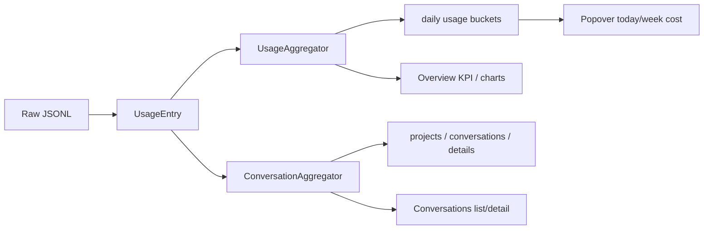

# 05 · 本地用量、对话与计价口径

## 数据源边界

当前本地用量只包括 `UsageApp.codex` 和 `UsageApp.claude`。Antigravity 没有进入日志用量聚合。**代码已确认**。

| Provider | 扫描根 | 主要记录 | 标识 / 标题来源 |
|---|---|---|---|
| Claude Code | `~/.claude/projects/**/*.jsonl` | `type=assistant` 的 message usage | `message.id`、sessionId、cwd、Claude history title/project；包含 subagent/sidechain 标记 |
| Codex | `~/.codex/sessions/**/*.jsonl` + `~/.codex/archived_sessions/**/*.jsonl` | `event_msg.token_count`、session metadata、thread settings | 文件名 UUID、session_meta id、user_message、turn_context、Codex session index |

路径是外部 Provider 的原始日志，不是 cc-bar 自己的缓存；新版可以读取它们，但不能把旧 cc-bar 的 rollup 当作新版输入。**代码已确认；跨端边界为文档声称**。

## 共用 JSONL 读取语义

`JSONLLineReader` 按字节 offset 读取，只返回完整换行行；最后一个没有换行的半行不消费，下一次继续从相同 offset 读取。目录枚举递归 `.jsonl`、跳过隐藏项；时间戳用 ISO8601。**代码已确认**。

通用 `UsageEntry` 字段：app、conversationKey、model、speed、day/timestamp、input/output/cacheRead/cacheCreation、costUSD、costBreakdown。原始 Token 总量是 input + output + cache read + cache creation；不把 Fast 倍率乘回原始总 Tokens。**代码已确认**。

## Claude scanner

`Core/Usage/ClaudeJSONLScanner.swift` 的静态协议：

1. 枚举所有 project JSONL；以 mtime、size、offset 判断是否可增量读取。
2. 如果文件被截断，offset 归零；已有 seen id 仍由全局去重保护。
3. 只解析 assistant 行，要求 sessionId、message.usage、`output_tokens > 0`。
4. speed 读取 usage.speed：fast / standard / 其他或缺失 → unknown。
5. `message.id` 是稳定去重键；重复 streaming 行合并，优先保留 output 更完整或 stop_reason 非空的候选。
6. 只有 stop_reason 非空才视为完整；半成品不进入最终 entries，seen IDs 上限约 20,000。
7. 保留 cache creation aggregate，并拆 `ephemeral_5m_input_tokens` / `ephemeral_1h_input_tokens`；不一致时按 aggregate 约束分配并 clamp。
8. 同时产生 conversation seed、标题索引、项目/sidechain/subtask 元数据。

**代码已确认、测试已确认**：Fixture 测试覆盖重复文件、重复 message、流式半成品、追加完整消息和 offset resume。

## Codex scanner

`Core/Usage/CodexJSONLScanner.swift` 的静态协议：

1. 同时扫描 sessions 和 archived sessions；同一 UUID 两处存在时按最新 mtime 去重。
2. `session_meta` 保存 conversation id/cwd；`user_message` 提供 fallback title；`turn_context` 和 nested `thread_settings_applied` 提供 model/speed。
3. service tier：`default` → standard，`priority`/fast → fast，未知/缺失 → unknown。
4. 对 `token_count` 使用 `last_token_usage` 作为本次请求增量；从 input 中扣 cached input 和 cache write，避免重复计费。
5. `total_token_usage` 用 signature 去重；总量没变的连续 token_count 不产生 entry。
6. 文件截断时 offset、model、service tier、cumulative signature 重置，但保留 conversation identity，下一轮从头重建状态。
7. 每条 entry 带 usage speed、model、conversation seed、pricing 结果。

**代码已确认、测试已确认**：Fixture 覆盖 tier transitions、追加一组累计用量、重复扫描零行、截断后更换模型和 speed。

## 两条聚合链

### UsageAggregator

按 day + app + model + speed 聚合 UsageBucket，保存 input/output/cache/request/cost/unpriced 标志。`UsageService.publishTotals()` 将今日费用暴露给 AppState，Popover 只拿 Codex/Claude 的今日/本周。**代码已确认**。

### ConversationAggregator

以 conversationKey 保存全生命周期 entries 和 ConversationInfo，不读取 message body；标题最长 80 字符。项目会经过路径标准化、symlink/git root/cwd 解析：

- available：路径仍存在；
- unavailable：曾有记录但路径消失；
- unassigned：没有可靠项目；
- system：CCBar probe/wakeup 产生的系统任务。

同名项目不合并，用父目录补充显示；Claude history 的项目来源优先级高于一般 cwd；支持子任务标志和 Claude sidechain。**代码已确认**。

查询支持 app、project、from/to、search、sort recent/tokens/cost；detail 永远返回该对话全生命周期，不受列表日期范围限制。**代码已确认**。

### 标题索引

`ConversationTitleIndex` 读取 Codex `session_index.jsonl` 和 Claude `history.jsonl`，按 mtime+size 缓存；清理标题、限制长度、跳过以 `<` 开头的疑似注入标题。**代码已确认**。

## Pricing 口径

`Core/Usage/Pricing.swift` 负责最终计算，`Core/Pricing/` 负责外部价格目录。

### 费用字段

`CostBreakdown` 分为 input、output、cacheRead、cacheCreation，单位是 USD/MTok；总费用为四项之和。Claude cache creation 会区分 5m / 1h TTL；Codex 没有可靠 cache write 时按代码默认。**代码已确认**。

### 标准 / Fast / Unknown

- Standard：优先使用动态目录中 LiteLLM，然后 models.dev，最后使用本地内置表；未知模型返回 nil price。
- Fast：只在 speed 明确为 fast 时使用显式 Fast 费率；Codex GPT-5.5/5.6 超过 272,000 input context 时，部分 Fast 价格返回 nil；Claude Fast 有模型专用倍率/费率。
- Unknown speed：不猜成 standard/fast，cost 可为 nil。
- Fast 的 billing-equivalent tokens 单独计算，展示层可显示倍率/范围；未知 Fast 模型混入时会保留原始 Fast Tokens，但倍率/等效总值带 unpriced 标记或不显示。

**代码已确认、测试已确认**：测试覆盖 GPT-5.5 长上下文、GPT/Claude Fast、Claude cache TTL、未知价格和 Fast 等效 Token。

### 动态目录

`PricingCatalogStore`：

- 本地 `pricing-catalog.json` v1，按 LiteLLM/models.dev 各自保存 etag、fetchedAt、failedAt、rates；
- 正常约 24 小时刷新，失败约 30 分钟重试；后台刷新不阻塞当前扫描；
- pending 价格在扫描开始时 commit；
- 新目录为空、无效或发生可疑大幅 shrink 时保留旧 rates；
- fingerprint 纳入本地/fast/multiplier/cache 规则和已知远端 rate。

**代码已确认**：动态目录改变 fingerprint 后会使 rollup/scan state 失效并重算。网络真实可用性、本地目录当前内容和第三方价格的正确性是**待确认**，本次未联网。

## UI 消费口径

| UI | 数据 | 口径 |
|---|---|---|
| Popover 服务卡 | AppState quota snapshot + UsageAggregator 今日/本周 | Codex/Claude 显示估算花费；Antigravity 不显示本地 cost |
| Overview KPI | UsageAggregator | 当前日期范围总 Token/费用，与上一等长范围 delta |
| Daily chart | 按 day 合并 Codex/Claude | 单日选择会追加近 14 天上下文，但 KPI 仍只算选定范围 |
| By service/model | UsageAggregator | Token、input/output/cache hit、命中率、Fast 信息和费用 |
| Conversation list | ConversationAggregator query | 过滤后的范围摘要；按最近/Token/费用排序 |
| Conversation detail | ConversationAggregator detail | 全生命周期 Token、费用、速度、模型、项目、持续时间 |
| Timeline | QuotaHistoryStore | 额度整数剩余值变化，不是本地日志用量 |

## 可重建与不可重建数据

- 原始 Provider JSONL 是外部事实源，可以重扫；但日志可能被 Claude 自动清理，代码因此有一次性 backfill 入口。**代码已确认**。
- Usage rollup、Conversation rollup、scan state、title index 都是派生数据，理论上可由原始日志/价格重建；损坏或 fingerprint/generation 不一致时应重建。**代码已确认**。
- quota snapshot/history 不能由本地日志重建：snapshot 来自 Provider，history 是观察时点；没有网络/缓存时只能保留旧值。**合理推断**。
- Imported Codex Token 不是可由日志重建的派生数据，保存在安全存储；删除后只能重新粘贴。**代码已确认**。
- 一次性 `ImportedUsageBackfill` 读取固定的应用支持目录 JSON，将缺失 Claude 日补成 `UsageEntry`；这不是新版必须保留的迁移能力。**代码已确认**。

