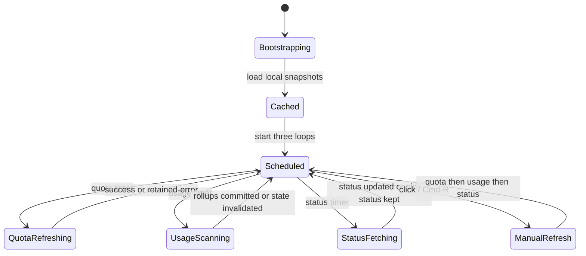

# 06 · 状态、持久化、调度与错误恢复

## 设置默认值

`Core/Storage/Settings.swift` 的实际设置如下。这里列“代码默认”，不是旧布局文档的意图。

| 设置 | 代码默认 / 可选值 | 改动效果 |
|---|---|---|
| Provider enabled/menuBar/floatingHUD | 三个主 Provider 默认 true | 影响 Popover、菜单栏、HUD；Provider 尚未检测到时 Settings 行仍可显示状态 |
| `menuBarWindow` | `primary`；可选 primary/weekly/both | 只影响菜单栏数字，不改变 Provider 请求 |
| `floatingEnabled` | false | `FloatingPanelController.sync()` 显示/隐藏 HUD |
| HUD Provider 行 | 默认 true | 影响 HUD 内容；开关 disabled 取决于 floatingEnabled |
| `quotaInterval` | `m2` = 120 秒；1/2/3/5/10 分钟 | 取消并重启 quota loop |
| `usageInterval` | `m5` = 300 秒；1/2/3/5/10 分钟 | 取消并重启 usage loop |
| `resetTimeDisplay` | relative | ResetTimeText 的默认显示，hover 可看相反格式 |
| `showServiceStatus` | true | 只控制 Popover status dot 是否画出，后台 status loop 仍运行 |
| `appLanguage` | system | 跟随 `Locale.preferredLanguages.first` 是否以 `zh` 开头 |
| `privacyMode` | true | Popover 主邮箱、导入账号名称隐藏；设置/导入预览不隔离输入内容 |
| `launchAtLogin` | 以 `SMAppService.mainApp.status` 为准 | 注册/注销系统 Login Item；requiresApproval 也视为开启并提示用户 |
| `didShowKeychainPrompt` | false | 只控制 Claude Keychain 授权说明是否已解释 |
| `didCompleteOnboarding` | false | 控制首次引导是否应出现 |
| floating frame | nil | 首次使用右下角默认位置；窗口外则回退默认位置 |

**代码已确认**：实际 Settings 没有 `menuBarVariant`、`floatingVariant`、`floatingPosition`、`floatingIdleOpacity`、`autoRefreshEnabled`、`showInDock` 等字段。

## UserDefaults 与迁移

- 一般设置使用 `ccbar.settings.*` UserDefaults key；Provider 三组显示开关现在收敛到 `providerDisplaySettings.v1` JSON，首次读取兼容旧的 Codex/Claude/Antigravity 平行 key。**代码已确认**。
- `menuBarWindow` 兼容旧 raw value `fiveHour`，读到后迁移为 `primary`。**代码已确认**。
- launchAtLogin 每次以系统 `SMAppService.mainApp.status` 同步，而不是盲信 UserDefaults。**代码已确认**。
- 本次没有发现旧 cc-bar UserDefaults 到跨端新版的迁移协议；跨端草案明确新版不读旧 settings。**代码已确认 / 文档声称**。

## 磁盘数据表

路径均相对于用户的应用支持目录，实际应用目录名为 `CCBar`；文档不写本机绝对路径。

| 数据 | 文件 / 版本 | 内容 | 密敏感性 | 能否重建 | 无效时行为 |
|---|---|---|---|---|---|
| quota cache | `quota-cache.json` v3 | 主 Provider snapshot/source/updatedAt、可选 imported snapshot | 不含 token，但含额度/plan/时间 | 不能由日志重建；可由 Provider 重新取 | 缺失/损坏返回空 payload；UI 显示等待/错误 |
| quota history | `quota-history-today.json` v2 | 当天 lastSamples 和额度变化 events | 可能含账号 key、时间和额度 | 不能补回未观察的时间点 | 当天切换时新建；主 limit id/kind 变化清 baseline |
| usage rollup | `usage-rollup.json` v8 | 每日 app/model/speed buckets、generation、pricing fingerprint | Token/费用/项目 key | 可由外部 JSONL + pricing 重建 | generation/fingerprint 不匹配则 rebuild |
| conversation rollup | `conversation-rollup.json` v5 | 对话信息、全生命周期 buckets、generation/fingerprint | 标题、路径、ID、Token/费用 | 可由外部 JSONL 重建 | 与 usage rollup 不同代则不恢复 |
| scan state | `scan-state.json` v9 | 文件 mtime/size/offset、Claude seen IDs、Codex model/tier/signature、conversation metadata | 路径、会话 ID、标题 | 可由外部 JSONL 重建 | version/fingerprint/generation 无效则 invalidate |
| pricing catalog | `pricing-catalog.json` v2 | LiteLLM/models.dev 的 ETag、成功／失败时刻、Standard／Fast rates、缺价冷却 | 公开价格，无 secret | 可重新拉取；本地表是 fallback | 无效/空/Standard 可疑 shrink 保留旧 catalog，Fast 保留 last-known |
| imported Codex metadata | `imported_codex_accounts.json` v1 | id、alias、email、plan、visible、addedAt、PAT 标志 | 账号元数据，不含 token | 不能由日志重建；需重新导入 | 缺失即无导入账号 |
| one-time backfill | `imported-usage-claude-2026H1-gapfill.json` | 外部工具补录的 UsageBucket | 统计和模型信息 | 外部备份可重生成 | 文件不存在就跳过 |
| floating frame | UserDefaults keys | x/y/w/h | 本地 UI 状态 | 可回默认 | 屏幕外回默认 |

`quota-cache`、history、rollup、scan state、pricing、imported metadata 均使用临时文件/atomic 写法。**代码已确认**。新版可借鉴“派生数据可重建 + generation/fingerprint 绑定 + 原子保存”的原则，但不应直接读取这些文件。

## 安全存储边界

| 数据 | 当前存放 |
|---|---|
| 主 Codex OAuth/PAT | 外部 Codex auth JSON；Token 读入内存，主 OAuth refresh 成功回写外部文件 |
| Claude access/refresh | 外部 credentials JSON 或 macOS Keychain；刷新按原来源回写 |
| Imported Codex Token 三件套 | macOS Keychain，独立 service namespace；元数据另存 JSON |
| Antigravity CSRF / 端口 | 进程发现期间内存使用，不保存 OAuth token |
| cc-bar 自己的 cache/rollup | 应用支持目录普通 JSON，不应包含 bearer/refresh token |

**代码已确认**：`CodexAccount`/`ClaudeAccount` 的 Token 仅内存字段；导入 Token 走 Keychain。**跨端文档声称**：Tauri 新版只通过 Rust 和系统安全存储访问，秘密不进入 Vue 层。

## 调度时序



### 额度节流

- 周期触发：若距最近成功少于 60 秒，跳过该 Provider。**代码已确认**。
- 用户触发：可以绕过 60 秒最小成功间隔。**代码已确认**。
- 任一 refresh state 有 `inFlight` 时跳过同 Provider；整体 `refreshNow` 也有独立去重。**代码已确认**。
- 429：Provider state `backoffUntil = now + 10min`；周期和手动都不能在这段时间真正请求。**代码已确认**。
- 网络/解析/认证失败：设置 lastError，保留旧 snapshot；下一周期仍可尝试，除非进入 429 backoff 或 refresh 协议自身冷却。**代码已确认**。

### Claude 专项节流

- OAuth refresh：文件礼让窗口约 10 秒、Coordinator in-flight、invalid_grant 软恢复。
- delegated CLI refresh：5 分钟冷却、PTY timeout、成功通知后再查 quota。
- quota CLI fallback：只有手动刷新且 API 失败且无快照才进入；当前 AppState 在调用前设置 10 分钟冷却。**代码已确认**。

## 错误恢复和数据一致性

1. **身份变化先清理。** Codex 比较 account id/email/PAT token；Claude 比较 email；Antigravity 比较返回 email。变化后清理旧 snapshot/cache，防止新凭据配旧额度。**代码已确认**。
2. **新网络结果不覆盖未来 reset 的真实信息。** 同 limit id/kind 且新 reset 缺失时保留旧未来 reset；已过期不保留。**代码已确认、测试已确认**。
3. **rollup 与 watermark 同代。** UsageService 先写 rollup，最后写 scan state；任一失败就 invalidate，使下次全量扫描。**代码已确认**。
4. **价格变更触发重算。** pricing fingerprint 改变会让 usage/conversation rollup 失效；pending catalog 在扫描开始前提交。**代码已确认**。
5. **quota history 只记录整数变化。** 相同整数剩余值不追加 event；limit kind/id 变化先重设 baseline。**代码已确认、测试已确认**。
6. **状态显示允许降级。** 缓存、CLI fallback 或 `.local` 来源会记录 source；UI 不应把非 API 数据伪装成新鲜 API 成功。**代码已确认**。

## 旧版与新版的存储边界

```text
旧 cc-bar 自有数据
  UserDefaults / Application Support/CCBar / Keychain service / HUD frame
  → 新版不读取、不迁移、不覆盖、不删除

Codex / Claude Code 外部数据
  当前凭据、原始 JSONL、外部 CLI 状态
  → 只有新版产品授权后才能读，按平台适配和最小权限实现

Tauri 新应用数据
  新设置、新 cache、新 index、新 security namespace
  → 独立 schemaVersion 和升级路径
```

这是跨端方案的硬边界，不是“以后可以顺手兼容”的默认项。**文档声称**。
