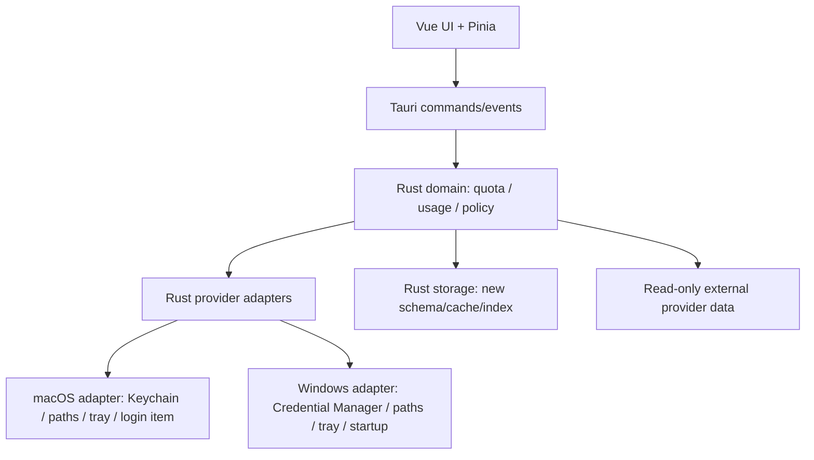

# 08 · 跨端复用决策矩阵

## 已确认的新应用边界

跨端草案的决策是：独立新仓库、独立应用身份、独立数据目录和独立发布；目标 macOS + Windows；Tauri 2 + Vue 3 + TypeScript + Vite + Rust + Pinia + Vue Router。新版不把 Swift 版视为重构分支，也不默认复刻旧页面、旧设置或旧功能全量。

| 边界 | 新版结论 | 证据 |
|---|---|---|
| 旧 Swift/Xcode 工程 | 不复制、不作为 build dependency | **文档声称** |
| 旧 cc-bar 自有设置/缓存/rollup/scan state | 不读取、不迁移、不修改、不删除 | **文档声称** |
| 旧导入 Codex 账号 | 不自动导入；新版如需导入，用户重新提供 | **文档声称** |
| 旧 Keychain service namespace | 不使用、不覆盖 | **文档声称** |
| Codex / Claude Code 外部凭据 | 可以读取，但通过 Rust/平台安全层，不暴露给 Vue | **文档声称 + 当前代码提供来源事实** |
| Codex / Claude Code 原始 JSONL | 可以只读扫描，按新 schema 建自己的 index/rollup | **文档声称 + 当前代码提供格式事实** |
| 旧视觉/页面结构 | 不作为新版目标 | **文档声称** |
| 当前业务结论 | 可作为 provider/额度/日志/定价经验参考 | **文档声称、代码已确认** |

## 复用分类

| 当前模块/能力 | 复用等级 | 新版处理 | 不能直接复用的原因 |
|---|---|---|---|
| `QuotaSnapshot` / limit kind 语义 | A · 复用业务合同 | 用 Rust domain model 重新定义 schema 和序列化 | Swift 类型、Codable 迁移和 UI 依赖不应带入 |
| Codex wham 请求字段 | A · 复用协议事实 | 做 Rust provider + 脱敏 response fixture | Endpoint/字段可能变化，不能只靠旧 parser |
| Claude OAuth usage 字段 | A · 复用协议事实 | 做 Rust provider + legacy/dynamic fixtures | refresh token 轮换和平台安全需重做 |
| Antigravity loopback 观察经验 | B · 有条件参考 | macOS adapter 先验证，Windows 单独设计 | 当前依赖 App 路径、ps、lsof、macOS TLS 行为 |
| 429 / 60s / 10min 退避原则 | A · 复用业务规则候选 | 作为可测试 policy，最终参数由新版确认 | 旧参数不一定适合新产品/接口 |
| 失败保留 snapshot | A · 复用业务合同候选 | Rust state machine 测试 | 是行为原则，不是 Swift 代码 |
| Codex/Claude credentials discovery | B · 平台适配参考 | Rust platform service；secret 只在 backend | macOS Keychain、Windows Credential Manager、路径差异 |
| Claude delegated CLI refresh | C · macOS 专用候选 | 只有产品决定支持时放进 macOS adapter | PTY、watchdog、TCC、CLI 路径都是 macOS 实现 |
| Claude CLI quota fallback | C · 可选 Provider adapter | 重新评估是否进入新版 v1 | 交互脆弱、依赖 CLI 可执行文件和真实登录 |
| JSONL offset/partial/truncate | A · 复用 scanner contract | Rust scanner tests + temp fixtures | 代码重写，路径/权限/文件监听要平台化 |
| Claude message id dedupe | A · 复用数据规则 | 直接作为 scanner contract | 仍要验证不同日志版本 |
| Codex cumulative signature | A · 复用数据规则 | 作为增量 scanner contract | 旧 signature 字段不当作新版 schema |
| Usage/Conversation 聚合 | B · 产品候选 | 只有进入新版范围才实现；重新设计 domain/UI | 旧版聚合与 UI 绑定，且新版不一定首版包含 |
| Pricing 本地表 | B · 参考样例 | 重建价格政策、来源和更新窗口 | 价格会变化；旧本地表不应盲目继承 |
| LiteLLM/models.dev catalog | B · 可选数据源 | 重新评估隐私、稳定性、license、网络失败策略 | 远程数据不等于可永久依赖 |
| `QuotaHistoryStore` timeline | B · 后续能力 | 进入范围后复用“整数变化/基线”规则 | 旧文件和 v2 schema 不迁移 |
| Imported Codex accounts | B · 后续能力 | 重新做安全存储、导入 UX、隔离语义 | 旧元数据/Keychain 不兼容新版边界 |
| `SettingsStore` | D · 不复用实现 | 重新定义 settings schema 和 migration | UserDefaults、SMAppService、旧字段都是 macOS/旧产品耦合 |
| `AppState` | D · 不复制 | 新版拆 Rust domain/store/commands + Vue stores | 当前是巨大 MainActor coordinator，跨端不适合作为架构模板 |
| `Scheduler` | C · 只复用概念 | 新版重写可取消任务/后台策略 | Swift Task 和 Tauri app lifecycle 不同 |
| SwiftUI `PopoverRootView` / `StatsView` | D · 不复用 UI | 重新设计信息架构、视觉和交互 | 跨端草案明确不做 Swift 页面复刻 |
| `FloatingPanelController` / HUD | C · macOS 经验 | 新版先确认是否需要；平台等价实现 | NSPanel、Space、全屏和 frame 行为不跨平台 |
| `CCBarClaudeWatchdog` | C · macOS 构建/恢复经验 | 只作为 helper 设计参考 | Rust/Tauri 进程树、签名和 Windows job object 不同 |
| XCTest 文件/测试名 | B · 行为样本 | 将断言转 Rust/Vue/adapter contract | XCTest API、Bundle fixture 和临时路径不复用 |
| Assets/SVG/截图/设计风格 | D · 不作为新版目标 | 只可作历史参考；重新做品牌和 UI | 新版明确全新视觉体验 |
| release workflow / build.sh | D · 不复用实现 | 新仓库独立 CI、签名、安装包和 Release | 新平台、新仓库、新标识和新供应链 |

## 推荐的新版分层

建议把以下逻辑放在共享 Rust domain：额度窗口标准化、状态机、退避、snapshot retain、JSONL 解析/去重、Token/费用规则（若进入范围）、存储 schema 校验。把以下逻辑放在平台适配层：安全存储、Provider 凭据发现路径、托盘/菜单栏、窗口行为、开机启动、CLI/PTY、进程发现和系统权限。**合理推断**。

## 首版候选分层

### 首版必须候选

- macOS Menu Bar + Windows System Tray。
- Codex、Claude Code 自动发现和额度读取。
- primary quota、reset time、last refresh、loading/stale/offline/error。
- 手动/自动刷新、429 退避、失败保留 snapshot。
- 新版独立 cache、基础设置、中文/英文/跟随系统。
- Rust 后端 secret boundary。

### 首版简化候选

- 只做主账号，不做 imported Codex。
- 只做 Overview/紧凑入口，不做 Conversations/Timeline。
- 只做必要 Provider status，不做完整动态 Pricing。
- 只做一个跨平台紧凑窗口，不做 HUD。

### 后续候选

- 本地用量、对话详情、Timeline、Pricing、Fast。
- 其他 Codex 账号、Reset Credits、复杂日期筛选。
- HUD、隐私模式、诊断和高级 Provider。

### 明确不做或不自动继承

- 旧数据迁移与旧 Keychain 兼容。
- Swift 页面一对一翻译。
- 应用内 Provider 登录、浏览器 Cookie 导入、WebView 抓 Provider 页面。
- 旧版所有设置字段的兼容。

## 开始实现前必须回答的问题

这些不是本次静态审计替用户做的产品决定：

1. 新版 v1 是否只做 Codex + Claude，Antigravity 放后续？
2. v1 是否必须有本地用量；如果没有，是否连外部日志也不读取？
3. 额度只显示 primary，还是需要 weekly/model-scoped/Gemini 等专项窗口？
4. “自动刷新”默认间隔和 429 退避参数是否沿用旧版，还是按新版 UX 重定？
5. 是否允许 CLI fallback / delegated refresh；如果允许，macOS 和 Windows 的安全边界如何验收？
6. v1 是否需要 imported Codex 账号；若需要，用户如何确认“只监控、不切换 CLI 登录状态”？
7. v1 是否需要服务状态圆点，statuspage 拉取失败时展示什么？
8. 是否需要 HUD；若需要，跨平台等价物是独立窗口、桌面 widget 还是不做？
9. Pricing 是否进入 v1；费用是 API 等值估算还是只显示 Token？
10. 新应用是否允许读取外部日志的项目路径、标题和对话 ID；隐私模式的隐藏范围是什么？
11. 新旧应用并行安装时，如何展示“它们互不迁移、互不覆盖”的用户说明？
12. Windows 上 Codex/Claude/Antigravity 的凭据、日志和本地进程路径由谁确认并提供脱敏 Fixture？

在这些答案锁定前，不应把当前 `AppState`、`SettingsStore`、`FloatingPanelController` 或 25 个 XCTest 机械搬进新仓库。

