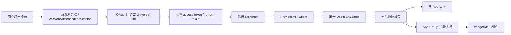

# 10 · 移动端获取 Codex 与 Claude 用量的实现方向

> 状态：方向性方案，不是已经承诺稳定的 Provider SDK。
>
> 本文依据 Nowdex 1.0.1（本机安装包）的静态字符串、资源和依赖观察整理，目标是说明移动端应该怎样取得订阅额度。它不是 Nowdex 源码，也不是对 Provider 内部接口长期稳定性的保证。

## 先说结论

移动端获取 Codex 和 Claude 用量，建议走下面这条链路：

1. 用户在系统浏览器中完成 Provider OAuth 登录。
2. App 通过 OAuth 回调拿到授权结果，交换 access token / refresh token。
3. Token 只放在系统 Keychain，不放进普通数据库、日志或前端状态。
4. App 直接请求 Provider 的 usage 接口，拿到当前账号的额度窗口。
5. 将不同 Provider 的响应统一成自己的 `UsageSnapshot`，再交给页面、Widget 和通知使用。
6. 请求失败时保留最近一次成功快照，并明确标记 stale / error，不把额度清空成“0”。

这意味着：

- 移动端不需要读取电脑上的 `~/.codex`、`~/.claude` 或 JSONL 会话日志；iOS 沙盒也不适合把“读取电脑本地文件”当作首版方案。
- 首版不需要自建中转服务器。直接由手机请求 Provider，可以避免把用户 Token 放到自己的服务器。
- “额度”与“本地用量/费用统计”是两条数据链。额度来自 Provider usage API；本地会话统计需要读取桌面端日志，不能由移动端凭空补出来。

## 从 Nowdex 观察到的证据

本次观察到的主 App 和 Widget 都包含以下类型或字符串：

- `CodexOAuthClient`、`ClaudeOAuthClient`、`OAuthLoginCoordinator`、`LoopbackOAuthCallbackServer`。
- `ClaudeUsageService`、`ClaudeUsageStore`、`UsageService`、`WidgetUsageFetcher`。
- `ASWebAuthenticationSession`、`CryptoKit`、`Security`、`WidgetKit`。
- Codex / Claude 的 OAuth token endpoint 和 usage endpoint。
- `claude-oauth-credentials`、`chatgpt-oauth-credentials` 等 Keychain 键名。
- App Group、Widget 快照和同步日志相关资源。

同时没有发现 `.codex`、`.claude`、`session.jsonl`、`sessionKey`、浏览器 Cookie 或 Nowdex 自有中转域名等明显证据。因此当前更可信的判断是：Nowdex 采用“OAuth + Keychain + Provider usage API + Widget 缓存/同步”，而不是扫描本机 CLI 日志或抓取网页。

以上属于“安装包静态证据”。正式实现仍要用脱敏账号做运行时抓包、回调和响应验证，不能把二进制字符串直接当成稳定协议。

## 推荐的整体链路



建议把“登录、Token 续期、Provider 请求和 JSON 解析”放在原生安全层；页面只拿脱敏后的额度模型，不拿 Token。若使用 Flutter、React Native 或其他跨端 UI，也应保持这个边界。

## 两个 Provider 的请求方向

下表是从 Nowdex / 现有 cc-bar 观察到的接口方向。它们部分属于面向官方客户端的内部或未公开接口，必须做可替换 Provider adapter，不能把 URL 和字段散落到 UI 代码。

| Provider | OAuth 授权 | Token 交换 | Usage 请求 | 典型请求信息 |
|---|---|---|---|---|
| Codex | `https://auth.openai.com/oauth/authorize` | `https://auth.openai.com/oauth/token` | `https://chatgpt.com/backend-api/wham/usage` | `Authorization: Bearer`；可能需要 `ChatGPT-Account-Id` |
| Claude | `https://claude.ai/oauth/authorize` | `https://api.anthropic.com/v1/oauth/token` | `https://api.anthropic.com/api/oauth/usage` | `Authorization: Bearer`；观察到 `anthropic-beta: oauth-2025-04-20` |

### Codex

方向上需要解析：

- `plan_type`：账号套餐或计划类型。
- `rate_limit.primary_window`：主要额度窗口。
- `rate_limit.secondary_window`：可选的周窗口或第二额度窗口。
- 窗口中的 `used_percent`、`reset_at`、`reset_after_seconds`、`limit_window_seconds`。
- 账号变化判断所需的 account id / user id / email（如果响应提供）。

Nowdex 还包含：

```text
GET https://chatgpt.com/backend-api/wham/rate-limit-reset-credits
```

这个接口可作为“重置额度积分/额外 Credits”类信息的后续能力，不建议和主额度快照混成同一个必需请求。首版先保证 `/wham/usage` 能稳定显示。

### Claude

方向上需要解析订阅 usage 响应中的：

- 5 小时 session 窗口。
- 7 天全模型窗口。
- Opus / Sonnet 等模型专项窗口（如果账号和响应提供）。
- `extra_usage`、`credits`、`used_credits` 等额外用量信息（如果响应提供）。
- `reset_at` / `resets_at`、百分比和 active 状态。

静态字符串中还观察到一组 Claude OAuth scope，例如 `user:profile`、`user:inference`、`user:sessions:claude_code` 等。正式产品应按实际 usage 接口需要申请最小 scope，并在登录说明里告诉用户用途；不要因为参考应用出现过某个 scope，就默认全部照抄。

## OAuth 和回调：移动端要重新确认

Nowdex 的安装包中观察到两个 loopback 回调：

```text
Codex:  http://localhost:1455/auth/callback
Claude: http://localhost:54545/callback
```

这可以作为研究方向，但不应直接视为 iOS 的最终方案。移动端实现应优先确认：

- Provider 是否支持 Authorization Code + PKCE。
- `ASWebAuthenticationSession` 是否能稳定接管该回调。
- 是否应改用自有 URL Scheme、Universal Link 或官方推荐的回调方式。
- App 从后台切回前台、用户取消登录、重复回调和超时如何处理。
- 回调中只接收短期授权结果，不把 access token 放在 URL、剪贴板或日志中。

推荐把 OAuth 流程封装成：

```text
OAuthCoordinator
  start(provider)
  receiveCallback(code/state)
  exchangeToken(code)
  refreshIfNeeded()
  revokeOrClear()
```

每个 Provider 只提供自己的 endpoint、scope、解析和错误映射，不能让页面拼接 URL 或自己判断 Token 过期。

## 统一数据模型

可以先用下面的最小模型承接两个 Provider：

```text
ProviderCredential
  provider
  accessToken       // 仅安全层可见
  refreshToken      // 仅安全层可见
  expiresAt
  accountId
  email             // 展示前可脱敏

UsageSnapshot
  provider
  accountKey
  planType
  limits[]
  extraUsage?
  fetchedAt
  source             // api / cache
  state              // fresh / stale / error
  lastError?

UsageWindow
  id                 // primary / weekly / model-scoped 等
  usedPercent
  remainingPercent
  resetsAt?
  windowSeconds?
  isActive
```

需要保留的业务规则：

- 不认识的窗口保留为 `unknown`，不要根据字段名猜成 5 小时或周额度。
- `remainingPercent` 统一限制在 0 到 100。
- 身份变化时先清除旧账号的快照，防止新 Token 显示旧额度。
- 某个 Provider 失败不能阻断另一个 Provider。
- 429 必须进入退避；手动刷新也不能无视退避。
- Token refresh 成功后只更新 Keychain，不向 UI 广播 Token 内容。

## Widget、缓存和后台刷新

移动端后台执行受系统调度控制，不能承诺像桌面常驻进程一样每两分钟精准刷新。建议分两层：

### 首版建议

- 主 App 成功获取 usage 后，把脱敏快照写入 App Group 共享目录。
- Widget 先展示最近快照和 `fetchedAt`，明确“最后更新于……”或 stale 状态。
- 用 `WidgetCenter` 请求刷新，但接受系统延迟、网络不可用和刷新次数限制。
- App 被用户打开时优先读缓存、再后台刷新，保证页面先有内容。

### 后续可选

- Widget 自己读取共享 Keychain 并直接访问 Provider API。
- 对于需要 refresh token 的场景，验证 Widget Extension 的 Keychain access group 和 App Group 权限。
- 对重要额度变化做本地通知；远程 Push 需要额外服务端和隐私设计，不应作为 v1 前置条件。

安全上不要为了让 Widget 工作，就把 refresh token 复制到普通 App Group 文件中。共享目录只放额度快照、更新时间、错误摘要和必要的账号展示信息。

## 失败处理和用户体验

建议状态机至少包含：`unauthenticated`、`loading`、`fresh`、`stale`、`rateLimited`、`authExpired`、`error`。

| 情况 | 处理方向 |
|---|---|
| 首次没有凭据 | 显示登录入口，不发 usage 请求 |
| access token 即将过期 | 原生层 refresh，成功后再请求 usage |
| 401 / refresh token 失效 | 清理失效凭据，要求重新登录；不显示旧账号为新账号 |
| 429 | 记录 `backoffUntil`，显示“稍后重试”，保留旧快照 |
| 网络失败 | 保留旧快照并标记 stale，显示最近成功时间 |
| JSON 字段变化 | Provider adapter 返回 decode error，保留旧快照并记录脱敏诊断 |
| Claude 账号不支持订阅 usage | 清楚说明“当前计划不可用”，不要误报为 0% |
| Widget 无法刷新 | 继续显示最后快照和时间，不把 Widget 变成空白错误页 |

## 实施顺序

### MVP：只验证“能安全显示额度”

1. 建立 Codex / Claude 两个 Provider adapter。
2. 用系统浏览器完成 OAuth，保存并刷新 Token。
3. 分别请求 usage，保存脱敏 JSON fixture 和统一 `UsageSnapshot`。
4. 页面显示主窗口、剩余比例、重置时间、最后刷新时间和错误状态。
5. 加入 401、429、网络失败、空响应和账号切换测试。

### 第二阶段：移动端体验

- App Group 快照。
- WidgetKit 小组件。
- 前后台切换后的 refresh policy。
- Keychain access group 和 Widget 权限验收。
- 本地通知或系统小组件刷新策略。

### 第三阶段：再考虑统计

- 额外 credits / extra usage。
- 历史额度变化。
- 与桌面端同步的本地用量或费用统计。

“本地用量统计”必须另行设计同步协议：手机不能直接假设能读取电脑的 Claude / Codex JSONL。可以由桌面端生成脱敏摘要后同步，但这已经是新的跨设备产品能力，不属于“直接获取当前额度”。

## 主要风险和验证清单

- Codex `/backend-api/wham/usage` 与 Claude `/api/oauth/usage` 可能是内部接口，字段和权限会变化；所有请求都应隔离在 Provider adapter，并保留 fixture。
- 账号登录、scope、回调端口和 Apple 审核要求需要真实运行时验证；静态字符串只能说明“代码可能支持”。
- 不使用浏览器 Cookie、页面 DOM 抓取或用户手工复制 sessionKey 作为首版方案。
- 不在日志、崩溃报告、Analytics、Widget 快照中输出 access token、refresh token、完整邮箱或 account id。
- 不把 Claude API Key 或普通 OpenAI API Key 当成订阅额度 OAuth 的替代品；两者的权限和计费语义不同。
- 明确用户授权、隐私政策、Provider 条款和“只读额度、不读取对话内容”的边界。

正式开始实现前，至少用 Codex 和 Claude 各准备一个脱敏验证账号，逐项验证：首次登录、取消登录、Token refresh、401、429、离线缓存、账号切换、后台刷新、Widget 显示和 Provider 返回字段变化。

## 参考资料和证据边界

- [Nowdex App Store 页面](https://apps.apple.com/cn/app/nowdex/id6791450777)：产品入口和支持 Provider 的公开信息。
- 当前安装包 `Nowdex.app` 及其 Widget Extension：用于本次静态字符串、依赖和资源观察。
- [cc-bar 04 · 账号、凭据、Provider 与额度协议](04-账号凭据Provider与额度协议.md)：桌面端已整理的 Codex / Claude 请求、Token 续期和统一额度模型。
- [cc-bar 06 · 状态、持久化、调度与错误恢复](06-状态持久化调度与错误恢复.md)：失败保留快照、429 退避和缓存边界。
- [cc-bar 08 · 跨端复用决策矩阵](08-跨端复用决策矩阵.md)：跨平台安全层和 Provider adapter 的边界。

本文的 endpoint、字段和回调值只能作为实现起点；每次发布前应重新验证 Provider 的真实响应和平台权限。
