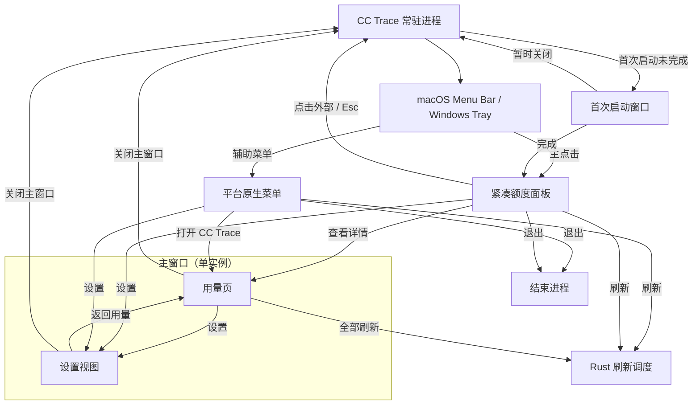
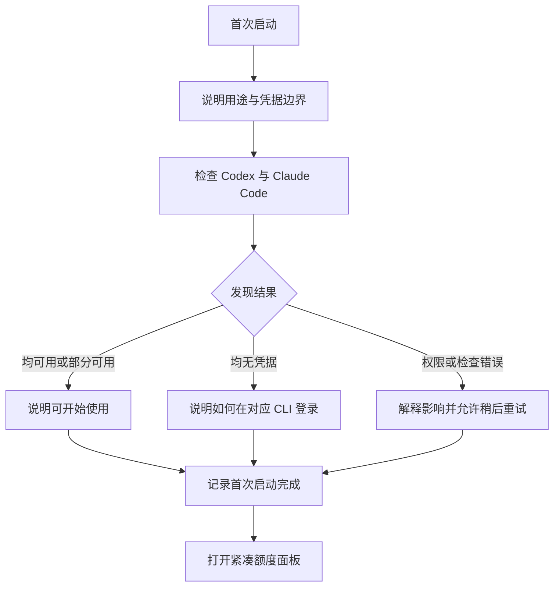
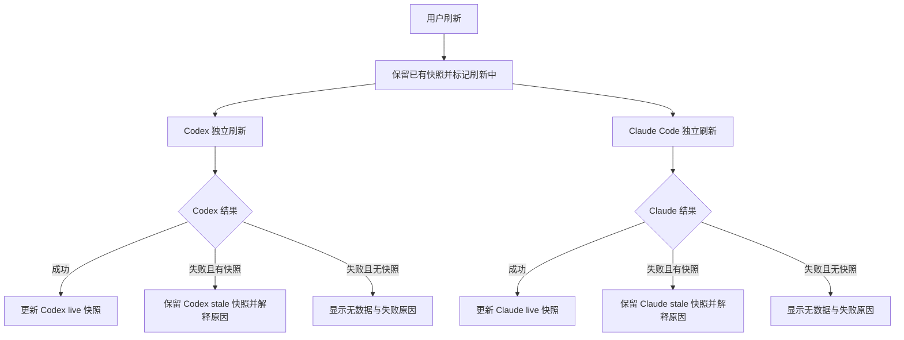

# CC Trace 信息架构与核心流程

> 状态：第 6 阶段基线
> 目标版本：`0.1.x`
> 基线日期：2026-07-25
>
> 现行变更（2026-07-30）：[ADR-0020](决策/ADR-0020-主窗口改为本地用量页.md) 已把主窗口从额度总览改为本地用量页，主窗口不再显示任何额度读数。受影响的是 §2.2、§2.3、§3、§6、§11、§13、§15，均已按新结论改写。紧凑面板、系统区域、首次启动与设置视图不受影响。

## 1. 本文职责

本文定义 CC Trace 首版的信息架构、系统入口、窗口职责、核心用户流程和状态分配，作为后续设计方向、交互原型与 Tray 桌面壳实现的输入。

本文不定义视觉风格、精确尺寸、组件样式、动效参数或 Provider 协议，也不授权提前实现正式业务页面。

正式产品和技术边界仍以以下文档为准：

- [产品定义](产品定义.md)
- [产品范围](产品范围.md)
- [技术架构](技术架构.md)
- [执行清单](Tauri桌面端重新开发执行清单.md)
- [AI 设计产品上下文](../PRODUCT.md)

## 2. 已确认的信息架构原则

### 2.1 平台原则

CC Trace 采用 `adaptive`：

- macOS 与 Windows 使用相同的业务语义、状态模型和核心任务。
- macOS 使用 Menu Bar 入口并遵循 macOS 窗口、快捷键和退出习惯。
- Windows 使用 System Tray 入口并遵循 Windows 托盘、上下文菜单和窗口习惯。
- 两个平台不追求像素级或操作级完全相同。
- Vue 业务视图优先共用；Tray、窗口生命周期、开机启动和平台菜单留在 Rust／Tauri 平台层适配。

### 2.2 任务层级

首版当前可见界面按用户问题划分三层：

1. **紧凑入口：现在额度紧不紧，今日／本周 Token API 等值费用是多少？**
2. **主窗口用量页：过去这段时间用了多少 Token、花了多少、是谁和哪个模型花的？**
3. **主窗口设置视图：应用应如何运行和显示？**

首次启动窗口只帮助用户理解产品边界、完成最小状态检查并进入上述日常流程，不承担长期业务功能。

三个表面按**时间尺度**分工，不按详细程度分工：紧凑入口回答「此刻」，主窗口回答「过去一段
时间」。两者数据源不同——紧凑入口读当前额度快照，主窗口读 `usage.db` 的历史聚合——因此结构
上不重叠。理由见 [ADR-0020](决策/ADR-0020-主窗口改为本地用量页.md)。

### 2.3 结构原则

- 系统区域图标是常驻入口，不承担完整状态表达。
- 单击系统区域图标优先打开紧凑额度面板，不直接打开主窗口。
- 主窗口默认显示用量页，并在同一窗口内提供设置二级视图。
- 用量页与设置同一时刻只显示一个；不增加常驻侧边栏、Tab 或未来功能占位。
- 主窗口不显示剩余百分比、重置时间、额度状态点或任何额度读数。
- 首次启动使用独立的最小引导窗口，不做长流程教学。
- 所有窗口和临时面板均为单实例；重复打开时聚焦已有实例。
- 关闭主窗口或首次启动窗口不等于退出应用。
- 只有明确的“退出 CC Trace”、macOS `⌘Q` 或对应平台退出命令才结束常驻进程。
- Conversations 与额度历史（`quota_events`）不进入本轮用量页；它们将来是与用量页并列的第二
  个视图，不追加到本页底部，也不在确认前预留入口。

## 3. 入口与窗口职责

| 表面 | 主要任务 | 必须包含 | 明确不包含 |
|---|---|---|---|
| 系统区域图标 | 召回 CC Trace | 主点击、辅助菜单、可辨识的 CC Trace 图标 | 完整额度文本、复杂状态色、业务详情 |
| 紧凑额度面板 | 快速判断风险与近期费用 | 总体状态、两个 Provider 额度概览、今日／本周 API 等值费用、刷新、主窗口入口、设置和退出入口 | Token 明细、Conversations、历史、筛选、图表、设置表单 |
| 主窗口用量页 | 理解一段时间的用量与花费 | 日期范围选择、总 Token 与总花费、两个 Provider 各自的用量与花费、每日花费趋势、按模型明细、设置入口 | 任何额度读数、Conversations、额度历史、设置表单、原始日志、多账号 |
| 主窗口设置视图 | 调整应用行为 | 返回用量、语言、外观、自动刷新、开机启动、价格目录更新、版本信息 | Provider 登录、账号编辑、额度详情、诊断日志 |
| 首次启动窗口 | 建立信任并检查环境 | 产品用途、凭据访问与续期边界、Provider 发现结果、权限说明、继续入口 | 长教学、应用内登录、强制修复、旧数据迁移 |
| 平台原生菜单 | 无需打开面板执行系统操作 | 打开主窗口、刷新、设置、退出 | 完整额度详情、复杂层级菜单 |

## 4. 系统区域入口

### 4.1 主点击

- macOS：单击 Menu Bar 图标，打开锚定在图标下方的紧凑额度面板。
- Windows：单击 Tray 图标，在系统托盘附近打开紧凑额度面板。
- 面板已经打开时再次主点击，关闭面板。
- 面板打开后点击外部或按 `Esc`，关闭面板。
- 关闭面板不停止刷新、不退出应用。

### 4.2 平台原生菜单

Windows 右键 Tray 图标打开原生上下文菜单。macOS 在平台能力和可发现性允许时提供等价的辅助菜单；无论是否提供右键，紧凑面板内必须始终能找到设置和退出。

原生菜单首版只包含：

1. 打开 CC Trace
2. 刷新额度
3. 设置
4. 退出 CC Trace

当正在刷新时，“刷新额度”显示进行中状态或不可重复触发；真正的请求合并仍由 Rust 调度层保证。

### 4.3 系统区域图标边界

系统区域承载两个 Provider 的**主额度剩余百分比**，主额度统一取 Provider 标准化输出的第一项，定义由 [额度领域模型](额度领域模型.md) 第 2、4 节拥有；系统区域形态由 [ADR-0017](决策/ADR-0017-系统区域显示额度数字与余量分档.md) 拥有。它推翻了原先「不把多个 Provider 数字塞进系统区域」的结论。

| 平台 | 承载方式 |
|---|---|
| macOS | 「Provider 标识 + 百分比」渲染成模板位图作为菜单栏图标，由系统按菜单栏外观着色 |
| Windows | 托盘不支持图标旁并排文字，同一份文本只进 tooltip，图标保持静态 |

- 只显示每个 Provider 返回的第一项额度，不按 5 小时／每周类型重选，也不提供窗口选择设置项。
- macOS 的位图是**单色**的：撤销的是「多个 Provider 数字」，不是「彩色百分比」。
- 不把错误长文案塞进系统区域；失败原因仍然只在紧凑面板和主窗口解释。
- 图标必须在浅色、深色和系统高对比环境中可辨识。
- 没有凭据、离线或错误时图标仍然存在，百分比位置显示占位符，不能因为没有额度数据而消失。

## 5. 紧凑额度面板

### 5.1 内容层级

紧凑面板从上到下分为三个区域：

1. **头部**（总体状态与全部操作，用分隔线与下方区隔）
   - 表面名「用量」，不是状态句。
   - 最近成功刷新时间。
   - 状态点，承担总体状态；需要处理的事在对应 Provider 里说，不在头部重复。
   - 四个图标按钮：全部刷新、查看详情、设置、退出。每个都有 Tooltip 与可访问名称，见 [ADR-0017](决策/ADR-0017-系统区域显示额度数字与余量分档.md)。
2. **Codex 概览**
   - Provider 名称、套餐名与脱敏身份提示。
   - 第一项额度作为主数据，显示剩余百分比、窗口名称和重置时间。
   - 主额度轨道下方并列 Token 用量的今日／本周 API 等值费用；它是公开价格估算，
     不是订阅实付。
   - 后续额度按 Provider 返回顺序显示在下方。
   - 当前状态或旧快照提示。
3. **Claude Code 概览**
   - 与 Codex 使用相同的信息语义。

两个 Provider 的状态都会让面板变高。内容超出窗口高度时只有概览区滚动，头部留在原地。

### 5.2 排序原则

- Provider 的空间顺序保持稳定：Codex → Claude Code，避免刷新后卡片跳动。
- 风险优先通过总体状态、状态标记和视觉权重表达，不通过动态重排 Provider。
- 每个 Provider 内优先展示当前最重要的额度窗口；必要专项额度作为次级信息，不抢占主要判断。

### 5.3 交互边界

- “查看详情”打开并聚焦主窗口，同时关闭紧凑面板。
- “设置”关闭紧凑面板，打开并聚焦主窗口，然后切换到设置视图。
- 完成引导后立即启动首次本地用量扫描，之后每 5 分钟自动启动一次增量扫描。后续设置页会
  接管该间隔，当前值固定。
- 不提供手动扫描按钮。额度刷新只控制额度接口，刷新图标也只在额度请求期间旋转，不反映
  本地用量扫描。
- 扫描期间保留上一份完成的费用汇总，完成后一次性更新；存在已定价记录时显示当前可计算金额，
  不显示 API 等值、未定价等状态说明或金额下限 `+`；全部无法定价、未扫描或读取失败时显示
  `—`。读数下方只显示“花费”，扫描状态只在今日／本周费用末尾显示小号灰色 loading。
- 单个 Provider 失败不阻断另一 Provider 的展示。
- 紧凑面板只给出可理解的短错误，不展示原始错误、文件路径或协议字段。

## 6. 主窗口

### 6.1 定位

主窗口是本地用量页与设置共用的单实例窗口，默认显示用量页。它回答「过去这段时间怎么用掉的」，
不重复紧凑面板的「现在紧不紧」。它不承担“更多功能的容器”，不使用常驻侧边栏或 Tab；设置作为
明确的二级视图按需进入。

用量页的数据全部来自 `usage.db`，查询契约由 [数据存储与用量索引](数据存储与用量索引.md) 第 6 节
拥有。它不订阅额度状态事件。

### 6.2 内容层级

自上而下单列，不分栏、不分页签：

1. **筛选行**
   - 日期快捷八档：今天、昨天、本周、本月、本年、7 天、30 天、全部。
   - 日期范围选择器。选定自定义范围时八档一起取消选中。
   - 不设 Provider 筛选器——两个 Provider 在下方并排展示，再加筛选器会形成两套机制。
2. **总览读数**
   - 只有**总 Token** 与**总花费**两个数字。
   - 总层不显示输入、输出、缓存维度；细节属于 Provider 层与模型表。
3. **按 Provider**
   - Codex 与 Claude Code **左右并排**，空间顺序固定，不随数值重排。
   - 每个 Provider 显示：花费、总 Token、输入、输出、缓存命中、缓存写入、缓存命中率。
   - 缓存命中率配一条该 Provider 色的轨道；两个百分比之间的差距需要可视化才读得出。
4. **每日花费**
   - 按 Provider 堆叠的日柱图，覆盖当前选定范围。
5. **按模型**
   - 一套表头，每个 Provider 一个分组。
   - 分组行显示该 Provider 小计；分组小计相加等于底部合计。
   - 点击表头时两组同时按该列排序，**分组边界固定**，Codex 组恒在 Claude 组上方。
   - 分组行与合计行不参与排序。

费用只到 Provider 与模型两个粒度，不按 Token 类型拆分。排布与颜色规则见
[ADR-0020](决策/ADR-0020-主窗口改为本地用量页.md) 第 3～5 节。

### 6.3 明确排除

用量页不包含：

- **任何额度读数**：剩余百分比、重置时间、额度状态点、刷新时间、刷新按钮。
- 设置表单。
- Conversations 与额度历史（`quota_events`）；Rust 契约已存在不等于本轮有界面。
- 消息正文、绝对文件路径、明文项目路径或任何身份明文。
- 自定义筛选（模型、速度）与数据导出。
- 其他账号或账号切换。
- Provider 登录和凭据编辑。
- 为未来功能预留的空侧边栏、Tab 或卡片。

## 7. 主窗口设置视图

### 7.1 定位

设置视图只负责用户可以安全改变的应用偏好，不承载额度详情或账号操作。它与用量页共用 `main` 窗口，但内容、标题和焦点路径保持独立。

### 7.2 信息分组

首版在主窗口内使用一条窄而清晰的设置阅读列，不建立设置侧边栏：

1. **返回**
   - 明确的“返回用量”入口。
2. **通用**
   - 自动刷新间隔。
   - 开机自动启动。
3. **外观与语言**
   - 中文、英文、跟随系统。
   - 浅色、深色、跟随系统。
4. **用量与计价**
   - 独立“更新价格目录”动作，不与额度刷新或本地 JSONL 扫描混用。
   - 更新中禁用；成功明确反馈；失败说明仍在使用旧目录。
5. **关于**
   - 产品名称和版本。
   - 数据与隐私边界的简短入口。

### 7.3 行为

- macOS 支持 `⌘,`，Windows 支持 `Ctrl+,` 打开设置。
- 两个平台都能从用量页、紧凑面板和原生菜单直接打开设置。
- 打开设置时复用并聚焦 `main` 窗口，不改变窗口尺寸，不创建第二个实例。
- “返回用量”切回用量页；从用量页进入时尽量把焦点还给原设置入口，从外部入口进入时落到用量页的首个有意义位置。
- “打开 CC Trace”始终显示用量页，不恢复上一次关闭时停留的设置视图。
- 在设置视图按 `⌘W`／`Ctrl+W` 关闭的是整个主窗口，应用继续常驻。
- 设置保存成功后立即更新相关界面；写入失败时保留原值并明确提示。
- 手动更新价格目录绕过 24 小时与失败冷却；扫描运行时网络请求可以完成，但新价格只在
  扫描安全边界提交。按钮请求期间不可重复触发。
- 不提供 Codex／Claude Code 凭据输入、编辑、删除或切换。

## 8. 首次启动

### 8.1 目标

首次启动只完成三件事：

1. 告诉用户 CC Trace 用来查看什么。
2. 解释凭据只由 Rust 层按最小范围访问，只有 token 续期结果会原位回写同一来源；
   CC Trace 不迁移 cc-bar 数据。
3. 展示 Codex、Claude Code 的发现结果并让用户进入日常使用。

### 8.2 流程

首次启动窗口采用单个短流程，可分为三个连续区域或至多三个步骤：

1. **认识 CC Trace**
   - 简短说明产品用途。
   - 说明应用会常驻系统区域。
2. **检查本机状态**
   - 分别检查 Codex、Claude Code。
   - 只显示 `available`、`no_credentials`、`unsupported` 或可理解的错误。
   - 如系统权限请求不可避免，先解释用途，再由用户触发。
3. **完成**
   - 有凭据时说明可以开始刷新。
   - 无凭据时说明仍可完成设置，之后登录对应 CLI 再刷新。
   - 用户未单独点击“检查本机”时，“开始使用”同时触发首次检查。
   - 完成后关闭首次启动窗口并打开紧凑额度面板。

### 8.3 边界

- 不在应用内登录 Provider。
- 不要求两个 Provider 都存在才能完成。
- 不强制用户修复无凭据状态。
- 不读取、迁移或询问 Swift 版 cc-bar 数据。
- 用户关闭引导时应用继续驻留系统区域；下一次主动打开时继续显示最小引导入口，直到用户明确完成。
- 完成标记只保存在 CC Trace 自己的设置 namespace。

## 9. 窗口与进程关系

### 9.1 单实例

- 紧凑面板、主窗口和首次启动窗口各自最多一个实例。
- 用量页与设置是同一个主窗口内的两个视图，不分别计为窗口实例。
- 打开已存在的主窗口时恢复、置前并聚焦，再切换到调用方指定的额度或设置视图。
- 从紧凑面板打开主窗口任一视图时先关闭紧凑面板，避免两个入口争夺焦点。

### 9.2 关闭与退出

| 操作 | macOS | Windows | 结果 |
|---|---|---|---|
| 关闭紧凑面板 | 点击外部、再次点击图标、`Esc` | 点击外部、再次点击图标、`Esc` | 应用继续常驻 |
| 关闭主窗口 | `⌘W` 或关闭按钮 | 关闭按钮或 `Alt+F4` | 应用继续常驻 |
| 主动退出 | `⌘Q`、紧凑面板或菜单退出 | Tray 菜单或紧凑面板退出 | 结束进程 |

Windows 首次关闭主窗口但应用仍驻留 Tray 时，可以显示一次非打扰式系统提示；之后不重复打扰。是否采用该提示在 Tray 桌面壳验证阶段根据平台表现决定。

## 10. 核心用户流程

### 10.1 首次启动

### 10.2 日常查看

1. 用户单击系统区域图标。
2. 紧凑面板立即展示已有快照和当前状态。
3. 用户从总体状态判断是否有额度风险。
4. 无需更多信息时，点击外部关闭面板。
5. 需要解释时，打开主窗口查看详情。

### 10.3 手动刷新

### 10.4 无凭据

1. 对应 Provider 显示 `no_credentials`，不显示伪造的 0%。
2. 另一个 Provider 继续正常刷新。
3. 紧凑面板使用短说明，主窗口提供完整解释。
4. 引导用户检查对应 CLI 的登录状态，不在 CC Trace 内要求粘贴 Token。
5. 用户完成外部登录后手动刷新，应用重新发现凭据。

### 10.5 离线、旧快照与错误

- 离线且有快照：继续显示旧额度，标记 `stale`，同时说明失败原因为 `offline`。
- 离线且无快照：显示离线空状态，不显示额度百分比。
- 非网络错误且有快照：继续显示旧额度，标记 `stale`，同时说明具体可展示错误类型。
- 非网络错误且无快照：显示 `error`，提供重试或可执行的外部处理建议。
- 429：保留快照，展示刷新受限及可再次尝试的时间；不得持续触发请求。
- 单个 Provider 失败：总体状态提醒风险，但另一 Provider 的成功结果保持 `live`。

## 11. 状态的展示职责

状态维度、取值、失败原因分类、优先级和退避语义由 [状态与错误模型](状态与错误模型.md) 定义，本节只规定各表面展示什么。

### 11.1 额度状态

主窗口不再显示额度，因此**额度状态只有紧凑面板与系统区域两个表面**。

| 场景 | 紧凑面板 | 系统区域 |
|---|---|---|
| 首次加载 | 骨架或明确加载中 | 百分比位置显示占位符 |
| 有快照并刷新 | 保留数值并显示刷新中 | 保留上一份百分比 |
| 刷新成功 | 当前额度 | 当前百分比 |
| 无凭据 | 短说明 | 占位符 |
| 凭据形式不支持 | 短说明 | 占位符 |
| 离线且有快照 | 旧额度加离线标记 | 保留上一份百分比 |
| 离线且无快照 | 离线空状态 | 占位符 |
| 协议或凭据错误且有快照 | 旧额度加错误标记 | 保留上一份百分比 |
| 协议或凭据错误且无快照 | 短错误说明 | 占位符 |
| 429 | 旧额度加受限标记 | 保留上一份百分比 |

> 待确认：`no_credentials`、`unsupported`、`offline`、`rate_limited`、`error` 的**完整解释、影响与
> 下一步暂时没有落脚点**。原规范由主窗口承担，该职责已随
> [ADR-0020](决策/ADR-0020-主窗口改为本地用量页.md) 失效。倾向让紧凑面板的异常 Provider 可展开
> 详情。未解决前，[产品范围](产品范围.md) 首版完成标准中的「错误状态完整」不成立，
> [文案与国际化](文案与国际化.md) 第 4 节的「主窗口用标题／影响／下一步三级结构」同样悬空。

### 11.2 用量与扫描状态

主窗口用量页只表达数据自身的可信度，不表达额度可信度。

| 场景 | 用量页 |
|---|---|
| 从未扫描 | 空状态，说明首次索引尚未完成 |
| 扫描中 | 保留上一份完成结果，读数旁显示小号进行中标记 |
| 部分失败 | 正常显示已提交数据，附脱敏的部分失败提示 |
| 空数据源 | 该 Provider 显示为空，不升级为全局错误 |
| 存在未定价条目 | 该行显示「未定价」；已定价行照常合计，不按 `0` 计入 |
| 数据库暂不可用 | 整页不可用说明；额度路径不受影响 |

## 12. 本地用量首次索引

本节定义后台行为与用户可理解的状态。紧凑面板只消费今日／本周按 Provider 聚合；主窗口用量页
的布局与内容由 §6 与 [ADR-0020](决策/ADR-0020-主窗口改为本地用量页.md) 拥有。Conversations 与
额度历史仍待后续 UI 切片确认。

1. 完成引导后立即发起首次后台扫描，之后由独立定时器每 5 分钟发起一次增量扫描。紧凑面板
   不提供手动扫描按钮。
2. 扫描开始后，状态可被查询；用户可以继续查看额度并可请求取消。
3. Codex 或 Claude Code 任一根目录不存在时，该来源显示为空；另一来源继续扫描。
4. 单个文件失败只计入部分失败，不中断其他文件。状态不暴露文件路径、标题或原始行。
5. 取消或应用退出后，已提交批次保留；下次从水位继续。
6. 空库、扫描中和部分失败时，查询仍返回已经提交的数据，并附独立扫描状态；不能把“尚未完成”伪装成“全量完成”。
7. 数据库或价格目录恢复不影响额度刷新。价格不可用时 Token 仍可查询，费用标为未定价。

紧凑面板与用量页都必须覆盖：加载、从未扫描、扫描中、部分失败、空数据、正常结果、未知价格和
数据库暂不可用，展示形态见 §11.2。已取消、进度控制、Conversations 与分页属于后续切片；
对话列表实现时必须分页，不一次加载全部对话。

## 13. 键盘、焦点与辅助访问

- 紧凑面板打开时，焦点进入总体状态或第一个可操作元素。
- `Esc` 关闭紧凑面板并把控制权交回系统区域入口。
- `Tab` 顺序遵循视觉和阅读顺序，不在装饰元素上停留。
- `Enter`／`Space` 激活当前按钮。
- 紧凑面板的刷新快捷键：macOS `⌘R`，Windows `Ctrl+R`，只刷新额度。本地用量由后台定时扫描。
  主窗口不显示额度，`⌘R`／`Ctrl+R` 在主窗口的语义待定，见
  [ADR-0020](决策/ADR-0020-主窗口改为本地用量页.md)「未解决问题」。
- macOS `⌘,`、Windows `Ctrl+,` 打开主窗口设置视图；重复触发只聚焦当前设置视图。
- `⌘W`／`Ctrl+W` 关闭当前主窗口；设置视图内部使用可见的“返回用量”，不把 `Esc` 复用为返回。
- macOS `⌘Q` 退出应用。
- 状态不只依赖颜色；百分比、状态词和辅助图形共同表达。
- 刷新、成功和错误反馈应由可访问状态区域通知，但避免重复播报每个 Provider 的无变化结果。
- 中英文、长账号名、长模型名和系统文字缩放不得遮挡主要额度与恢复操作。
- 用量页的模型表可排序表头必须可聚焦、可用 `Enter`／`Space` 激活，并通过 `aria-sort` 暴露
  当前排序列与方向。分组行与合计行不参与排序，也不进入排序控件的 `Tab` 顺序。
- 数量单位（万／亿、`K`／`M`／`B`）不能只靠视觉字号区分；完整数值通过 `title` 与无障碍名称提供。

## 14. 双平台等价矩阵

| 用户意图 | macOS | Windows | 共同业务结果 |
|---|---|---|---|
| 快速查看 | 单击 Menu Bar 图标 | 单击 Tray 图标 | 打开紧凑额度面板 |
| 打开详情 | 紧凑面板“查看详情” | 紧凑面板“查看详情”或 Tray 菜单 | 聚焦主窗口用量页 |
| 打开设置 | 用量页、紧凑面板、辅助菜单、`⌘,` | 用量页、紧凑面板、Tray 菜单、`Ctrl+,` | 聚焦主窗口并切换到设置视图 |
| 刷新额度 | 紧凑面板或辅助菜单 | 紧凑面板或 Tray 菜单 | 额度进入同一 Rust 刷新调度，不触发本地用量扫描；主窗口没有额度刷新入口 |
| 查看用量 | 紧凑面板“查看详情”、`⌘,` 外的主窗口入口 | 同左或 Tray“打开 CC Trace” | 聚焦主窗口用量页 |
| 关闭窗口 | `⌘W`／关闭按钮 | `Alt+F4`／关闭按钮 | 保持系统区域常驻 |
| 退出应用 | `⌘Q`／菜单退出 | Tray 菜单退出 | 结束进程 |

## 15. 第 6 阶段明确非目标

- 不选择最终视觉世界、颜色、字体、圆角、阴影和精确尺寸。
- 不制作高保真界面或交互原型。
- 不实现 Vue 正式业务页面。
- 不实现 Tauri Tray、平台菜单、窗口插件或开机启动。
- 不实现 Provider、凭据读取、真实刷新和缓存。
- 不复制 Swift 版 cc-bar 的 Popover、主窗口或设置结构。
- 不在本轮为 Conversations、Timeline 创建 Vue 导航；多账号与悬浮窗继续不设计入口。

第 6 阶段当时把本地用量整体排除在外。该结论已由
[ADR-0020](决策/ADR-0020-主窗口改为本地用量页.md) 推翻：本地用量页现在就是主窗口本体。

## 16. 下一阶段输入

第 7 阶段应基于本文确定：

- 系统区域、紧凑面板、主窗口两个视图和首次启动之间的视觉关系。
- 额度与状态的视觉层级。
- 浅色、深色、平台字体和组件规则。
- `loading`、`live`、`no_credentials`、`offline`、`stale`、`rate_limited` 和 `error` 的视觉表达。
- macOS、Windows 的平台差异以及共享业务组件边界。
- 键盘、焦点、reduced motion、中英文和长文本规则。

第 8 阶段再为上述结构制作 macOS Menu Bar／Windows Tray 等价交互原型。原型确认前不得进入正式业务页面或 Tray 桌面壳实现。
