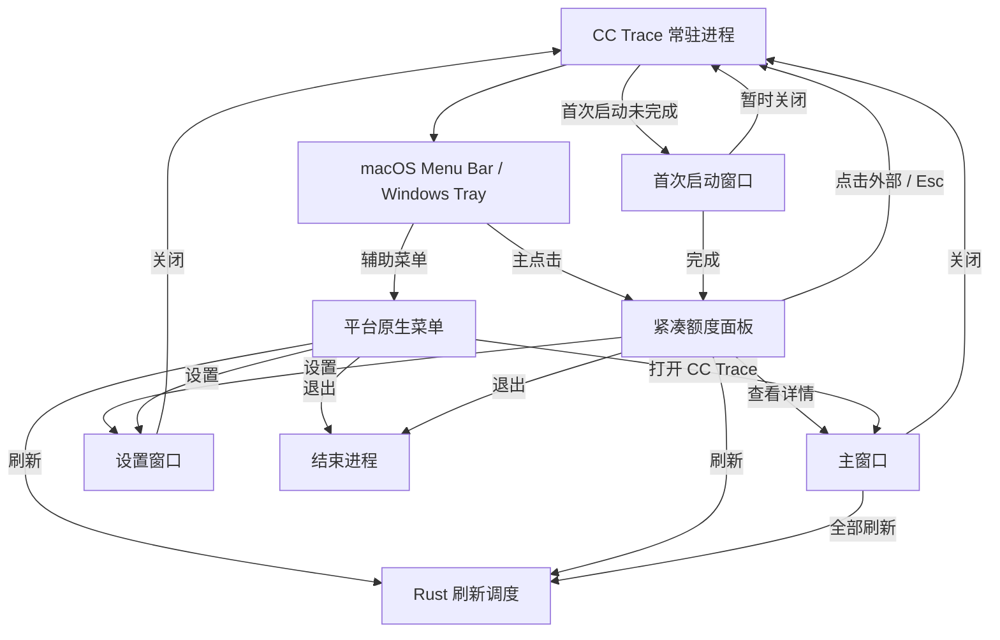
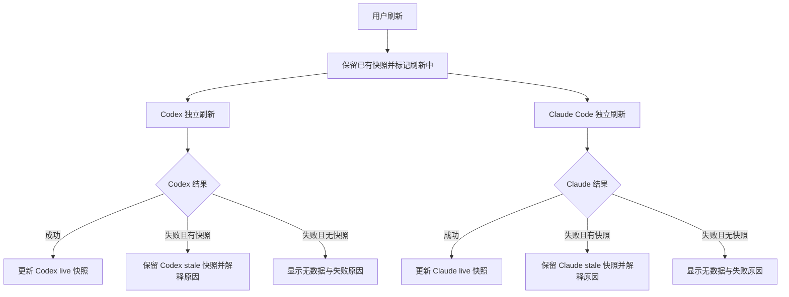

# CC Trace 信息架构与核心流程

> 状态：第 6 阶段基线
> 目标版本：`0.1.x`
> 基线日期：2026-07-25

## 1. 本文职责

本文定义 CC Trace 首版的信息架构、系统入口、窗口职责、核心用户流程和状态分配，作为后续设计方向、交互原型与 Tray 桌面壳实现的输入。

本文不定义视觉风格、精确尺寸、组件样式、动效参数或 Provider 协议，也不授权提前实现正式业务页面。

正式产品和技术边界仍以以下文档为准：

- [产品定义](产品定义.md)
- [产品范围](产品范围.md)
- [技术架构](技术架构.md)
- [执行清单](Tauri桌面端重新开发执行清单.md)
- [AI 设计产品上下文](../PRODUCT.md)

## 2. 已确认的信息架构原则

### 2.1 平台原则

CC Trace 采用 `adaptive`：

- macOS 与 Windows 使用相同的业务语义、状态模型和核心任务。
- macOS 使用 Menu Bar 入口并遵循 macOS 窗口、快捷键和退出习惯。
- Windows 使用 System Tray 入口并遵循 Windows 托盘、上下文菜单和窗口习惯。
- 两个平台不追求像素级或操作级完全相同。
- Vue 业务视图优先共用；Tray、窗口生命周期、开机启动和平台菜单留在 Rust／Tauri 平台层适配。

### 2.2 任务层级

首版按用户问题划分三层：

1. **紧凑入口：现在额度紧不紧？**
2. **主窗口：具体是哪项额度、何时重置、数据是否可信、失败后怎么办？**
3. **设置窗口：应用应如何运行和显示？**

首次启动窗口只帮助用户理解产品边界、完成最小状态检查并进入上述日常流程，不承担长期业务功能。

### 2.3 结构原则

- 系统区域图标是常驻入口，不承担完整状态表达。
- 单击系统区域图标优先打开紧凑额度面板，不直接打开主窗口。
- 主窗口是无侧边栏、无 Tab 的单页额度总览。
- 设置使用独立窗口，不嵌入主窗口导航。
- 首次启动使用独立的最小引导窗口，不做长流程教学。
- 所有窗口和临时面板均为单实例；重复打开时聚焦已有实例。
- 关闭主窗口、设置或首次启动窗口不等于退出应用。
- 只有明确的“退出 CC Trace”、macOS `⌘Q` 或对应平台退出命令才结束常驻进程。
- 首版不为后续能力预留空页面、空导航或不可用入口。

## 3. 入口与窗口职责

| 表面 | 主要任务 | 必须包含 | 明确不包含 |
|---|---|---|---|
| 系统区域图标 | 召回 CC Trace | 主点击、辅助菜单、可辨识的 CC Trace 图标 | 完整额度文本、复杂状态色、业务详情 |
| 紧凑额度面板 | 快速判断风险 | 总体状态、两个 Provider 概览、刷新、主窗口入口、设置和退出入口 | 完整错误诊断、历史、筛选、设置表单 |
| 主窗口 | 理解详情并恢复 | 全局刷新、两个 Provider 完整额度、状态解释、旧快照说明 | 设置表单、历史、统计、多账号、原始日志 |
| 设置窗口 | 调整应用行为 | 语言、外观、自动刷新、开机启动、版本信息 | Provider 登录、账号编辑、额度详情、诊断日志 |
| 首次启动窗口 | 建立信任并检查环境 | 产品用途、只读边界、Provider 发现结果、权限说明、继续入口 | 长教学、应用内登录、强制修复、旧数据迁移 |
| 平台原生菜单 | 无需打开面板执行系统操作 | 打开主窗口、刷新、设置、退出 | 完整额度详情、复杂层级菜单 |

## 4. 系统区域入口

### 4.1 主点击

- macOS：单击 Menu Bar 图标，打开锚定在图标下方的紧凑额度面板。
- Windows：单击 Tray 图标，在系统托盘附近打开紧凑额度面板。
- 面板已经打开时再次主点击，关闭面板。
- 面板打开后点击外部或按 `Esc`，关闭面板。
- 关闭面板不停止刷新、不退出应用。

### 4.2 平台原生菜单

Windows 右键 Tray 图标打开原生上下文菜单。macOS 在平台能力和可发现性允许时提供等价的辅助菜单；无论是否提供右键，紧凑面板内必须始终能找到设置和退出。

原生菜单首版只包含：

1. 打开 CC Trace
2. 刷新额度
3. 设置
4. 退出 CC Trace

当正在刷新时，“刷新额度”显示进行中状态或不可重复触发；真正的请求合并仍由 Rust 调度层保证。

### 4.3 系统区域图标边界

- 使用已确认的 Tray／Menu Bar 微型品牌图标。
- 不把彩色百分比、多个 Provider 数字或错误长文案塞进系统区域。
- 图标必须在浅色、深色和系统高对比环境中可辨识。
- 没有凭据、离线或错误时图标仍然存在，不能因为没有额度数据而消失。

## 5. 紧凑额度面板

### 5.1 内容层级

紧凑面板从上到下分为四个区域：

1. **总体状态**
   - 当前最需要注意的状态。
   - 最近成功刷新时间。
   - 全部刷新操作。
2. **Codex 概览**
   - Provider 名称与脱敏身份提示。
   - 主要额度剩余百分比、窗口名称和重置时间。
   - 必要专项额度的紧凑摘要。
   - 当前状态或旧快照提示。
3. **Claude Code 概览**
   - 与 Codex 使用相同的信息语义。
4. **全局操作**
   - 查看详情。
   - 设置。
   - 可发现但弱化的退出入口。

### 5.2 排序原则

- Provider 的空间顺序保持稳定：Codex → Claude Code，避免刷新后卡片跳动。
- 风险优先通过总体状态、状态标记和视觉权重表达，不通过动态重排 Provider。
- 每个 Provider 内优先展示当前最重要的额度窗口；必要专项额度作为次级信息，不抢占主要判断。

### 5.3 交互边界

- “查看详情”打开并聚焦主窗口，同时关闭紧凑面板。
- “设置”打开并聚焦设置窗口，同时关闭紧凑面板。
- 全部刷新不清空已有数据；存在快照时继续展示快照并标记刷新中。
- 单个 Provider 失败不阻断另一 Provider 的展示。
- 紧凑面板只给出可理解的短错误，不展示原始错误、文件路径或协议字段。

## 6. 主窗口

### 6.1 定位

主窗口是无侧边栏、无 Tab 的单页额度总览。它不承担“更多功能的容器”，只解释当前额度、数据可信度和恢复操作。

### 6.2 内容层级

1. **窗口标题区**
   - CC Trace。
   - 两个 Provider 的总体健康摘要。
   - 最近成功刷新时间。
   - 全部刷新。
   - 设置入口。
2. **Codex 详情区**
   - 凭据发现状态。
   - 脱敏身份和计划信息（仅在数据可安全获得时）。
   - 主要额度与必要专项额度。
   - 每项额度的剩余比例、窗口名称和重置时间。
   - 最近成功刷新与最近尝试时间。
   - 当前活动、快照新鲜度和失败原因。
3. **Claude Code 详情区**
   - 与 Codex 使用相同的信息语义。
4. **解释与恢复**
   - 只在需要时出现。
   - 解释无凭据、离线、旧快照或协议错误的用户影响。
   - 提供可执行的下一步，不要求用户理解内部实现。

### 6.3 明确排除

主窗口不包含：

- 设置表单。
- 本地 Token、费用、Conversations 或 Timeline。
- 历史曲线、日期筛选和数据导出。
- 其他账号或账号切换。
- Provider 登录和凭据编辑。
- 原始 Provider 响应、Token、Cookie、文件路径或普通日志。
- 为未来功能预留的空侧边栏、Tab 或卡片。

## 7. 设置窗口

### 7.1 定位

设置窗口只负责用户可以安全改变的应用偏好，不承载额度详情或账号操作。

### 7.2 信息分组

首版使用一个短窗口和少量清晰分组，不建立设置侧边栏：

1. **通用**
   - 自动刷新间隔。
   - 开机自动启动。
2. **外观与语言**
   - 中文、英文、跟随系统。
   - 浅色、深色、跟随系统。
3. **关于**
   - 产品名称和版本。
   - 数据与隐私边界的简短入口。

### 7.3 行为

- macOS 支持 `⌘,` 打开设置。
- 两个平台都能从紧凑面板和原生菜单直接打开设置。
- 重复打开时聚焦已有窗口。
- 关闭设置只关闭窗口，不退出应用。
- 设置保存成功后立即更新相关界面；写入失败时保留原值并明确提示。
- 不提供 Codex／Claude Code 凭据输入、编辑、删除或切换。

## 8. 首次启动

### 8.1 目标

首次启动只完成三件事：

1. 告诉用户 CC Trace 用来查看什么。
2. 解释凭据只由 Rust 层按只读、最小范围发现，CC Trace 不迁移 cc-bar 数据。
3. 展示 Codex、Claude Code 的发现结果并让用户进入日常使用。

### 8.2 流程

首次启动窗口采用单个短流程，可分为三个连续区域或至多三个步骤：

1. **认识 CC Trace**
   - 简短说明产品用途。
   - 说明应用会常驻系统区域。
2. **检查本机状态**
   - 分别检查 Codex、Claude Code。
   - 只显示 `available`、`no_credentials`、`unsupported` 或可理解的错误。
   - 如系统权限请求不可避免，先解释用途，再由用户触发。
3. **完成**
   - 有凭据时说明可以开始刷新。
   - 无凭据时说明仍可完成设置，之后登录对应 CLI 再刷新。
   - 完成后关闭首次启动窗口并打开紧凑额度面板。

### 8.3 边界

- 不在应用内登录 Provider。
- 不要求两个 Provider 都存在才能完成。
- 不强制用户修复无凭据状态。
- 不读取、迁移或询问 Swift 版 cc-bar 数据。
- 用户关闭引导时应用继续驻留系统区域；下一次主动打开时继续显示最小引导入口，直到用户明确完成。
- 完成标记只保存在 CC Trace 自己的设置 namespace。

## 9. 窗口与进程关系

### 9.1 单实例

- 紧凑面板、主窗口、设置窗口和首次启动窗口各自最多一个实例。
- 打开已存在的主窗口或设置窗口时恢复、置前并聚焦。
- 打开主窗口或设置窗口时关闭紧凑面板，避免多个入口争夺焦点。

### 9.2 关闭与退出

| 操作 | macOS | Windows | 结果 |
|---|---|---|---|
| 关闭紧凑面板 | 点击外部、再次点击图标、`Esc` | 点击外部、再次点击图标、`Esc` | 应用继续常驻 |
| 关闭主窗口 | `⌘W` 或关闭按钮 | 关闭按钮或 `Alt+F4` | 应用继续常驻 |
| 关闭设置窗口 | `⌘W` 或关闭按钮 | 关闭按钮或 `Alt+F4` | 应用继续常驻 |
| 主动退出 | `⌘Q`、紧凑面板或菜单退出 | Tray 菜单或紧凑面板退出 | 结束进程 |

Windows 首次关闭主窗口但应用仍驻留 Tray 时，可以显示一次非打扰式系统提示；之后不重复打扰。是否采用该提示在 Tray 桌面壳验证阶段根据平台表现决定。

## 10. 核心用户流程

### 10.1 首次启动

### 10.2 日常查看

1. 用户单击系统区域图标。
2. 紧凑面板立即展示已有快照和当前状态。
3. 用户从总体状态判断是否有额度风险。
4. 无需更多信息时，点击外部关闭面板。
5. 需要解释时，打开主窗口查看详情。

### 10.3 手动刷新

### 10.4 无凭据

1. 对应 Provider 显示 `no_credentials`，不显示伪造的 0%。
2. 另一个 Provider 继续正常刷新。
3. 紧凑面板使用短说明，主窗口提供完整解释。
4. 引导用户检查对应 CLI 的登录状态，不在 CC Trace 内要求粘贴 Token。
5. 用户完成外部登录后手动刷新，应用重新发现凭据。

### 10.5 离线、旧快照与错误

- 离线且有快照：继续显示旧额度，标记 `stale`，同时说明失败原因为 `offline`。
- 离线且无快照：显示离线空状态，不显示额度百分比。
- 非网络错误且有快照：继续显示旧额度，标记 `stale`，同时说明具体可展示错误类型。
- 非网络错误且无快照：显示 `error`，提供重试或可执行的外部处理建议。
- 429：保留快照，展示刷新受限及可再次尝试的时间；不得持续触发请求。
- 单个 Provider 失败：总体状态提醒风险，但另一 Provider 的成功结果保持 `live`。

## 11. 状态模型与展示职责

首版不把所有情况压成一个互斥状态。每个 Provider 的展示状态由三层组成：

| 维度 | 值 | 回答的问题 |
|---|---|---|
| 活动 | `idle`、`loading`、`refreshing` | 现在是否正在工作？ |
| 快照新鲜度 | `empty`、`live`、`stale` | 当前展示的数据是否可信、是否为旧数据？ |
| 可用性／失败原因 | `ready`、`no_credentials`、`offline`、`rate_limited`、`error` | 为什么能或不能取得新数据？ |

组合示例：

| 场景 | 活动 | 快照 | 原因 | 紧凑面板 | 主窗口 |
|---|---|---|---|---|---|
| 首次加载 | `loading` | `empty` | `ready` | 骨架或明确加载中 | 说明正在检查 |
| 有快照并刷新 | `refreshing` | `live` 或 `stale` | `ready` | 保留数值并显示刷新中 | 保留详情并显示活动 |
| 刷新成功 | `idle` | `live` | `ready` | 当前额度 | 当前额度与成功时间 |
| 无凭据 | `idle` | `empty` | `no_credentials` | 短说明 | 原因和外部处理建议 |
| 离线且有快照 | `idle` | `stale` | `offline` | 旧额度加离线标记 | 旧额度、失败时间和解释 |
| 离线且无快照 | `idle` | `empty` | `offline` | 离线空状态 | 离线原因和重试 |
| 协议错误且有快照 | `idle` | `stale` | `error` | 旧额度加错误标记 | 可展示错误类型和重试 |
| 429 且有快照 | `idle` | `stale` | `rate_limited` | 旧额度加受限标记 | 可再次尝试时间 |

### 11.1 状态优先级

同一 Provider 同时存在多个信号时，按以下顺序决定用户首先看到的内容：

1. 安全或凭据问题。
2. 无快照的失败。
3. 有快照但无法刷新。
4. 正在刷新。
5. 当前实时额度。

已有快照不得因为开始刷新而被清空；旧快照不得因为仍有数值而被标记为成功。

## 12. 键盘、焦点与辅助访问

- 紧凑面板打开时，焦点进入总体状态或第一个可操作元素。
- `Esc` 关闭紧凑面板并把控制权交回系统区域入口。
- `Tab` 顺序遵循视觉和阅读顺序，不在装饰元素上停留。
- `Enter`／`Space` 激活当前按钮。
- 主窗口和紧凑面板中的刷新快捷键在原型阶段统一验证，macOS 优先考虑 `⌘R`，Windows 优先考虑 `Ctrl+R`。
- macOS `⌘,` 打开设置，`⌘W` 关闭当前窗口，`⌘Q` 退出应用。
- 状态不只依赖颜色；百分比、状态词和辅助图形共同表达。
- 刷新、成功和错误反馈应由可访问状态区域通知，但避免重复播报每个 Provider 的无变化结果。
- 中英文、长账号名、长模型名和系统文字缩放不得遮挡主要额度与恢复操作。

## 13. 双平台等价矩阵

| 用户意图 | macOS | Windows | 共同业务结果 |
|---|---|---|---|
| 快速查看 | 单击 Menu Bar 图标 | 单击 Tray 图标 | 打开紧凑额度面板 |
| 打开详情 | 紧凑面板“查看详情” | 紧凑面板“查看详情”或 Tray 菜单 | 聚焦主窗口 |
| 打开设置 | 紧凑面板、辅助菜单、`⌘,` | 紧凑面板或 Tray 菜单 | 聚焦设置窗口 |
| 刷新 | 紧凑面板、主窗口或辅助菜单 | 紧凑面板、主窗口或 Tray 菜单 | 进入同一 Rust 刷新调度 |
| 关闭窗口 | `⌘W`／关闭按钮 | `Alt+F4`／关闭按钮 | 保持系统区域常驻 |
| 退出应用 | `⌘Q`／菜单退出 | Tray 菜单退出 | 结束进程 |

## 14. 第 6 阶段明确非目标

- 不选择最终视觉世界、颜色、字体、圆角、阴影和精确尺寸。
- 不制作高保真界面或交互原型。
- 不实现 Vue 正式业务页面。
- 不实现 Tauri Tray、平台菜单、窗口插件或开机启动。
- 不实现 Provider、凭据读取、真实刷新和缓存。
- 不复制 Swift 版 cc-bar 的 Popover、主窗口或设置结构。
- 不为本地用量、Conversations、Timeline、Pricing、多账号或悬浮窗设计导航。

## 15. 下一阶段输入

第 7 阶段应基于本文确定：

- 系统区域、紧凑面板、主窗口、设置和首次启动之间的视觉关系。
- 额度与状态的视觉层级。
- 浅色、深色、平台字体和组件规则。
- `loading`、`live`、`no_credentials`、`offline`、`stale`、`rate_limited` 和 `error` 的视觉表达。
- macOS、Windows 的平台差异以及共享业务组件边界。
- 键盘、焦点、reduced motion、中英文和长文本规则。

第 8 阶段再为上述结构制作 macOS Menu Bar／Windows Tray 等价交互原型。原型确认前不得进入正式业务页面或 Tray 桌面壳实现。
